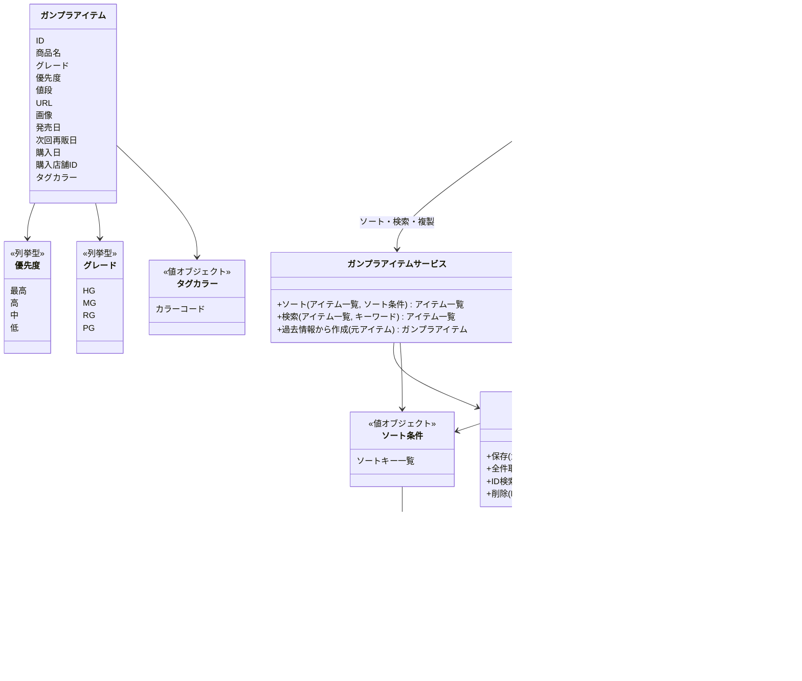

# F01 ほしい物リスト - 分析クラス図

```mermaid
classDiagram
    class ほしい物リスト画面 {
        <<画面>>
    }

    class ガンプラ登録編集画面 {
        <<画面>>
    }

    class ガンプラアイテム {
        ID
        商品名
        グレード
        優先度
        値段
        URL
        画像
        発売日
        次回再販日
        購入日
        購入店舗ID
        タグカラー
    }

    class 優先度 {
        <<列挙型>>
        最高
        高
        中
        低
    }

    class グレード {
        <<列挙型>>
        HG
        MG
        RG
        PG
    }

    class タグカラー {
        <<値オブジェクト>>
        カラーコード
    }

    class ソート条件 {
        <<値オブジェクト>>
        ソートキー一覧
    }

    class ソートキー {
        <<列挙型>>
        優先度
        再販日
        発売日
        グレード
        値段
    }

    class ガンプラアイテムリポジトリ {
        <<インターフェース>>
        +保存(ガンプラアイテム)
        +全件取得() ガンプラアイテム一覧
        +ID検索(ID) ガンプラアイテム
        +削除(ID)
    }

    class ガンプラアイテムサービス {
        +ソート(アイテム一覧, ソート条件) アイテム一覧
        +検索(アイテム一覧, キーワード) アイテム一覧
        +過去情報から作成(元アイテム) ガンプラアイテム
    }

    class SwiftData {
        <<外部システム>>
    }

    ほしい物リスト画面 --> ガンプラアイテムサービス : ソート・検索・複製
    ほしい物リスト画面 --> ガンプラアイテムリポジトリ : 一覧取得
    ほしい物リスト画面 --> ソート条件 : ソート条件を組み立て
    ほしい物リスト画面 --> ガンプラ登録編集画面 : 遷移
    ガンプラ登録編集画面 --> ガンプラアイテムリポジトリ : 保存・取得

    ガンプラアイテム --> 優先度
    ガンプラアイテム --> グレード
    ガンプラアイテム --> タグカラー
    ソート条件 --> ソートキー
    ガンプラアイテムサービス --> ガンプラアイテムリポジトリ
    ガンプラアイテムサービス --> ソート条件
    ガンプラアイテムリポジトリ --> SwiftData : ModelContext経由で永続化
```
