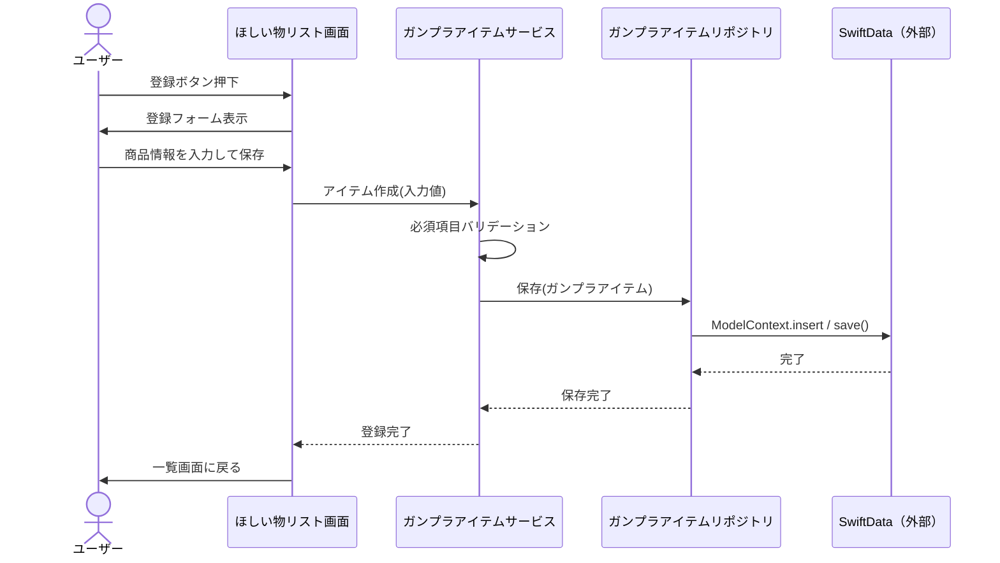
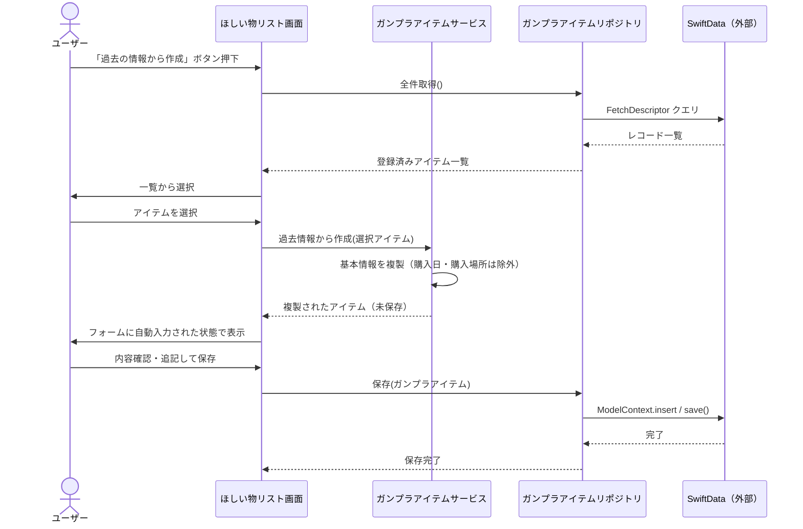
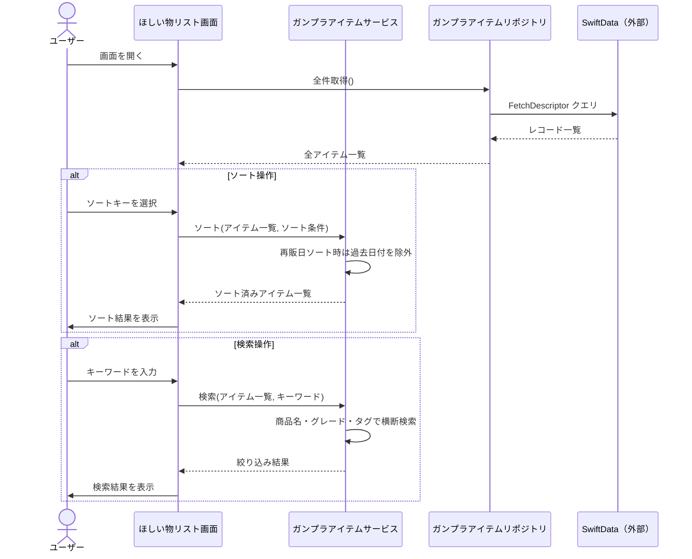

# F01 ほしい物リスト - 分析シーケンス図

## 新規登録

```mermaid
sequenceDiagram
    actor ユーザー
    participant ほしい物リスト画面
    participant ガンプラアイテムサービス
    participant ガンプラアイテムリポジトリ
    participant SwiftData（外部）

    ユーザー->>ほしい物リスト画面: 登録ボタン押下
    ほしい物リスト画面->>ユーザー: 登録フォーム表示
    ユーザー->>ほしい物リスト画面: 商品情報を入力して保存
    ほしい物リスト画面->>ガンプラアイテムサービス: アイテム作成(入力値)
    ガンプラアイテムサービス->>ガンプラアイテムサービス: 必須項目バリデーション
    ガンプラアイテムサービス->>ガンプラアイテムリポジトリ: 保存(ガンプラアイテム)
    ガンプラアイテムリポジトリ->>SwiftData（外部）: ModelContext.insert / save()
    SwiftData（外部）-->>ガンプラアイテムリポジトリ: 完了
    ガンプラアイテムリポジトリ-->>ガンプラアイテムサービス: 保存完了
    ガンプラアイテムサービス-->>ほしい物リスト画面: 登録完了
    ほしい物リスト画面->>ユーザー: 一覧画面に戻る
```

---

## 過去情報からの作成

```mermaid
sequenceDiagram
    actor ユーザー
    participant ほしい物リスト画面
    participant ガンプラアイテムサービス
    participant ガンプラアイテムリポジトリ
    participant SwiftData（外部）

    ユーザー->>ほしい物リスト画面: 「過去の情報から作成」ボタン押下
    ほしい物リスト画面->>ガンプラアイテムリポジトリ: 全件取得()
    ガンプラアイテムリポジトリ->>SwiftData（外部）: FetchDescriptor クエリ
    SwiftData（外部）-->>ガンプラアイテムリポジトリ: レコード一覧
    ガンプラアイテムリポジトリ-->>ほしい物リスト画面: 登録済みアイテム一覧
    ほしい物リスト画面->>ユーザー: 一覧から選択
    ユーザー->>ほしい物リスト画面: アイテムを選択
    ほしい物リスト画面->>ガンプラアイテムサービス: 過去情報から作成(選択アイテム)
    ガンプラアイテムサービス->>ガンプラアイテムサービス: 基本情報を複製（購入日・購入場所は除外）
    ガンプラアイテムサービス-->>ほしい物リスト画面: 複製されたアイテム（未保存）
    ほしい物リスト画面->>ユーザー: フォームに自動入力された状態で表示
    ユーザー->>ほしい物リスト画面: 内容確認・追記して保存
    ほしい物リスト画面->>ガンプラアイテムリポジトリ: 保存(ガンプラアイテム)
    ガンプラアイテムリポジトリ->>SwiftData（外部）: ModelContext.insert / save()
    SwiftData（外部）-->>ガンプラアイテムリポジトリ: 完了
    ガンプラアイテムリポジトリ-->>ほしい物リスト画面: 保存完了
```

---

## ソート・検索

```mermaid
sequenceDiagram
    actor ユーザー
    participant ほしい物リスト画面
    participant ガンプラアイテムサービス
    participant ガンプラアイテムリポジトリ
    participant SwiftData（外部）

    ユーザー->>ほしい物リスト画面: 画面を開く
    ほしい物リスト画面->>ガンプラアイテムリポジトリ: 全件取得()
    ガンプラアイテムリポジトリ->>SwiftData（外部）: FetchDescriptor クエリ
    SwiftData（外部）-->>ガンプラアイテムリポジトリ: レコード一覧
    ガンプラアイテムリポジトリ-->>ほしい物リスト画面: 全アイテム一覧

    alt ソート操作
        ユーザー->>ほしい物リスト画面: ソートキーを選択
        ほしい物リスト画面->>ガンプラアイテムサービス: ソート(アイテム一覧, ソート条件)
        ガンプラアイテムサービス->>ガンプラアイテムサービス: 再販日ソート時は過去日付を除外
        ガンプラアイテムサービス-->>ほしい物リスト画面: ソート済みアイテム一覧
        ほしい物リスト画面->>ユーザー: ソート結果を表示
    end

    alt 検索操作
        ユーザー->>ほしい物リスト画面: キーワードを入力
        ほしい物リスト画面->>ガンプラアイテムサービス: 検索(アイテム一覧, キーワード)
        ガンプラアイテムサービス->>ガンプラアイテムサービス: 商品名・グレード・タグで横断検索
        ガンプラアイテムサービス-->>ほしい物リスト画面: 絞り込み結果
        ほしい物リスト画面->>ユーザー: 検索結果を表示
    end
```
