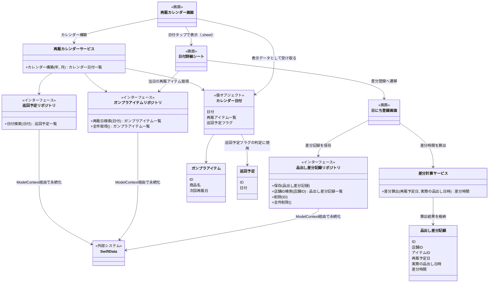

# F02 再販カレンダー - 分析クラス図

```mermaid
classDiagram
    class 再販カレンダー画面 {
        <<画面>>
    }

    class 日付詳細シート {
        <<画面>>
    }

    class 日にち登録画面 {
        <<画面>>
    }

    class カレンダー日付 {
        <<値オブジェクト>>
        日付
        再販アイテム一覧
        巡回予定フラグ
    }

    class 品出し差分記録 {
        ID
        店舗ID
        アイテムID
        再販予定日
        実際の品出し日時
        差分時間
    }

    class 再販カレンダーサービス {
        +カレンダー構築(年, 月) カレンダー日付一覧
    }

    class 差分計算サービス {
        +差分算出(再販予定日, 実際の品出し日時) 差分時間
    }

    class 品出し差分記録リポジトリ {
        <<インターフェース>>
        +保存(品出し差分記録)
        +店舗ID検索(店舗ID) 品出し差分記録一覧
        +削除(ID)
        +全件削除()
    }

    class ガンプラアイテムリポジトリ {
        <<インターフェース>>
        +再販日検索(日付) ガンプラアイテム一覧
        +全件取得() ガンプラアイテム一覧
    }

    class 巡回予定リポジトリ {
        <<インターフェース>>
        +日付検索(日付) 巡回予定一覧
    }

    class ガンプラアイテム {
        ID
        商品名
        次回再販日
    }

    class 巡回予定 {
        ID
        日付
    }

    class SwiftData {
        <<外部システム>>
    }

    再販カレンダー画面 --> 再販カレンダーサービス : カレンダー構築
    再販カレンダー画面 --> カレンダー日付 : 表示データとして受け取る
    再販カレンダー画面 --> 日付詳細シート : 日付タップで表示（.sheet）
    日付詳細シート --> ガンプラアイテムリポジトリ : 当日の再販アイテム取得
    日付詳細シート --> 日にち登録画面 : 差分登録へ遷移
    日にち登録画面 --> 差分計算サービス : 差分時間を算出
    日にち登録画面 --> 品出し差分記録リポジトリ : 差分記録を保存

    再販カレンダーサービス --> ガンプラアイテムリポジトリ
    再販カレンダーサービス --> 巡回予定リポジトリ
    再販カレンダーサービス --> カレンダー日付
    カレンダー日付 --> ガンプラアイテム
    カレンダー日付 --> 巡回予定 : 巡回予定フラグの判定に使用
    差分計算サービス --> 品出し差分記録 : 算出結果を格納
    品出し差分記録リポジトリ --> SwiftData : ModelContext経由で永続化
    ガンプラアイテムリポジトリ --> SwiftData : ModelContext経由で永続化
    巡回予定リポジトリ --> SwiftData : ModelContext経由で永続化
```
