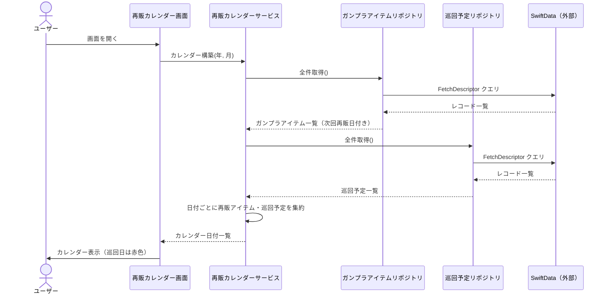
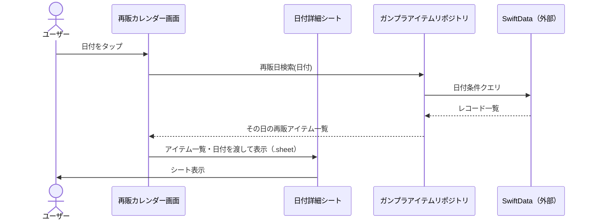
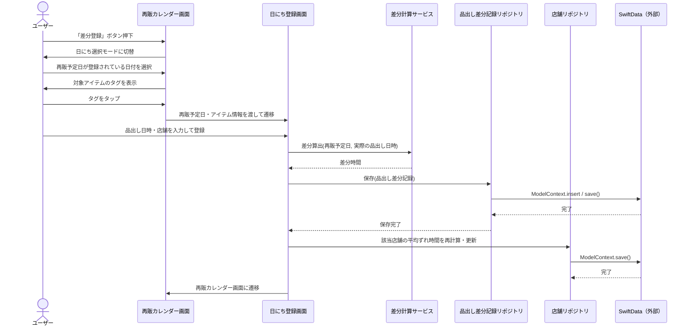

# F02 再販カレンダー - 分析シーケンス図

## カレンダー表示

```mermaid
sequenceDiagram
    actor ユーザー
    participant 再販カレンダー画面
    participant 再販カレンダーサービス
    participant ガンプラアイテムリポジトリ
    participant 巡回予定リポジトリ
    participant SwiftData（外部）

    ユーザー->>再販カレンダー画面: 画面を開く
    再販カレンダー画面->>再販カレンダーサービス: カレンダー構築(年, 月)
    再販カレンダーサービス->>ガンプラアイテムリポジトリ: 全件取得()
    ガンプラアイテムリポジトリ->>SwiftData（外部）: FetchDescriptor クエリ
    SwiftData（外部）-->>ガンプラアイテムリポジトリ: レコード一覧
    ガンプラアイテムリポジトリ-->>再販カレンダーサービス: ガンプラアイテム一覧（次回再販日付き）
    再販カレンダーサービス->>巡回予定リポジトリ: 全件取得()
    巡回予定リポジトリ->>SwiftData（外部）: FetchDescriptor クエリ
    SwiftData（外部）-->>巡回予定リポジトリ: レコード一覧
    巡回予定リポジトリ-->>再販カレンダーサービス: 巡回予定一覧
    再販カレンダーサービス->>再販カレンダーサービス: 日付ごとに再販アイテム・巡回予定を集約
    再販カレンダーサービス-->>再販カレンダー画面: カレンダー日付一覧
    再販カレンダー画面->>ユーザー: カレンダー表示（巡回日は赤色）
```

---

## 日付タップ → シート表示

```mermaid
sequenceDiagram
    actor ユーザー
    participant 再販カレンダー画面
    participant 日付詳細シート
    participant ガンプラアイテムリポジトリ
    participant SwiftData（外部）

    ユーザー->>再販カレンダー画面: 日付をタップ
    再販カレンダー画面->>ガンプラアイテムリポジトリ: 再販日検索(日付)
    ガンプラアイテムリポジトリ->>SwiftData（外部）: 日付条件クエリ
    SwiftData（外部）-->>ガンプラアイテムリポジトリ: レコード一覧
    ガンプラアイテムリポジトリ-->>再販カレンダー画面: その日の再販アイテム一覧
    再販カレンダー画面->>日付詳細シート: アイテム一覧・日付を渡して表示（.sheet）
    日付詳細シート->>ユーザー: シート表示
```

---

## 品出し差分登録

```mermaid
sequenceDiagram
    actor ユーザー
    participant 再販カレンダー画面
    participant 日にち登録画面
    participant 差分計算サービス
    participant 品出し差分記録リポジトリ
    participant 店舗リポジトリ
    participant SwiftData（外部）

    ユーザー->>再販カレンダー画面: 「差分登録」ボタン押下
    再販カレンダー画面->>ユーザー: 日にち選択モードに切替
    ユーザー->>再販カレンダー画面: 再販予定日が登録されている日付を選択
    再販カレンダー画面->>ユーザー: 対象アイテムのタグを表示
    ユーザー->>再販カレンダー画面: タグをタップ
    再販カレンダー画面->>日にち登録画面: 再販予定日・アイテム情報を渡して遷移
    ユーザー->>日にち登録画面: 品出し日時・店舗を入力して登録
    日にち登録画面->>差分計算サービス: 差分算出(再販予定日, 実際の品出し日時)
    差分計算サービス-->>日にち登録画面: 差分時間
    日にち登録画面->>品出し差分記録リポジトリ: 保存(品出し差分記録)
    品出し差分記録リポジトリ->>SwiftData（外部）: ModelContext.insert / save()
    SwiftData（外部）-->>品出し差分記録リポジトリ: 完了
    品出し差分記録リポジトリ-->>日にち登録画面: 保存完了
    日にち登録画面->>店舗リポジトリ: 該当店舗の平均ずれ時間を再計算・更新
    店舗リポジトリ->>SwiftData（外部）: ModelContext.save()
    SwiftData（外部）-->>店舗リポジトリ: 完了
    日にち登録画面->>再販カレンダー画面: 再販カレンダー画面に遷移
```
