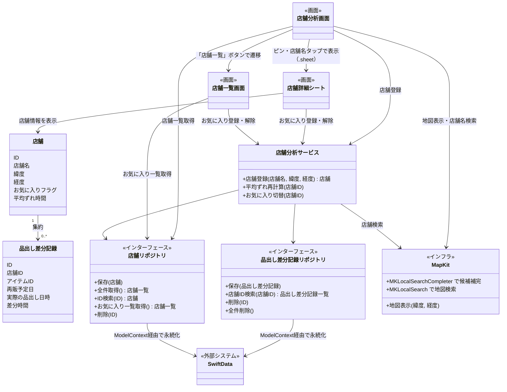

# F03 店舗分析 - 分析クラス図

```mermaid
classDiagram
    class 店舗分析画面 {
        <<画面>>
    }

    class 店舗詳細シート {
        <<画面>>
    }

    class 店舗一覧画面 {
        <<画面>>
    }

    class 店舗 {
        ID
        店舗名
        緯度
        経度
        お気に入りフラグ
        平均ずれ時間
    }

    class 品出し差分記録 {
        ID
        店舗ID
        アイテムID
        再販予定日
        実際の品出し日時
        差分時間
    }

    class 店舗分析サービス {
        +店舗登録(店舗名, 緯度, 経度) 店舗
        +平均ずれ再計算(店舗ID)
        +お気に入り切替(店舗ID)
    }

    class 店舗リポジトリ {
        <<インターフェース>>
        +保存(店舗)
        +全件取得() 店舗一覧
        +ID検索(ID) 店舗
        +お気に入り一覧取得() 店舗一覧
        +削除(ID)
    }

    class 品出し差分記録リポジトリ {
        <<インターフェース>>
        +保存(品出し差分記録)
        +店舗ID検索(店舗ID) 品出し差分記録一覧
        +削除(ID)
        +全件削除()
    }

    class MapKit {
        <<インフラ>>
        +MKLocalSearchCompleter で候補補完
        +MKLocalSearch で地図検索
        +地図表示(緯度, 経度)
    }

    class SwiftData {
        <<外部システム>>
    }

    店舗分析画面 --> 店舗分析サービス : 店舗登録
    店舗分析画面 --> 店舗リポジトリ : 店舗一覧取得
    店舗分析画面 --> MapKit : 地図表示・店舗名検索
    店舗分析画面 --> 店舗詳細シート : ピン・店舗名タップで表示（.sheet）
    店舗分析画面 --> 店舗一覧画面 : 「店舗一覧」ボタンで遷移
    店舗詳細シート --> 店舗 : 店舗情報を表示
    店舗詳細シート --> 店舗分析サービス : お気に入り登録・解除
    店舗一覧画面 --> 店舗リポジトリ : お気に入り一覧取得
    店舗一覧画面 --> 店舗分析サービス : お気に入り登録・解除
    店舗分析サービス --> MapKit : 店舗検索

    店舗 "1" --> "0..*" 品出し差分記録 : 集約
    店舗分析サービス --> 店舗リポジトリ
    店舗分析サービス --> 品出し差分記録リポジトリ
    品出し差分記録リポジトリ --> SwiftData : ModelContext経由で永続化
    店舗リポジトリ --> SwiftData : ModelContext経由で永続化
```
