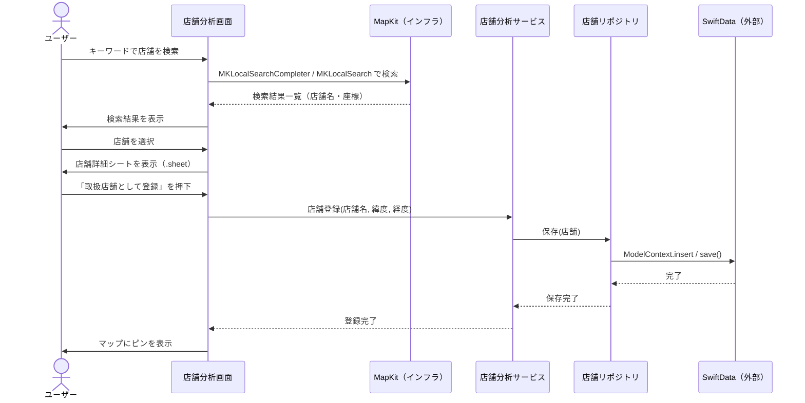
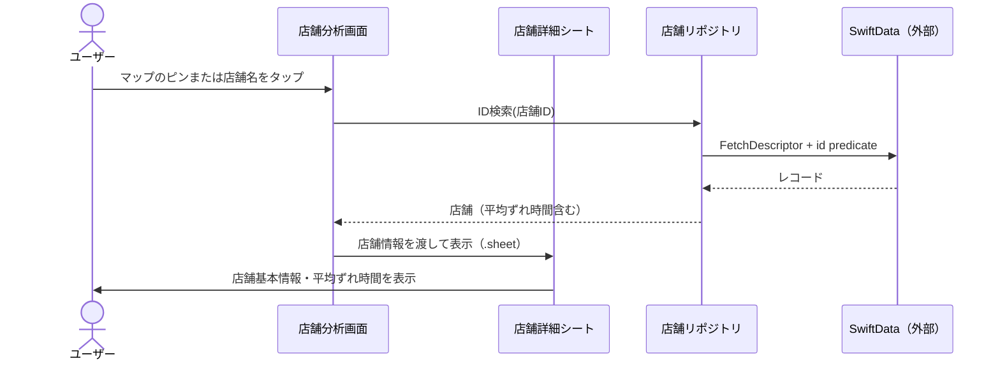
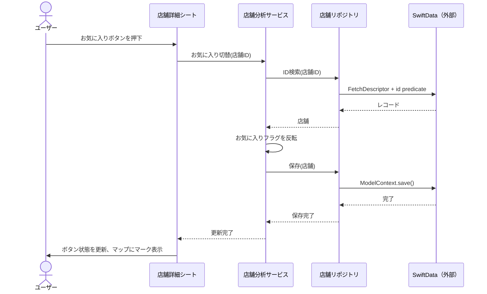
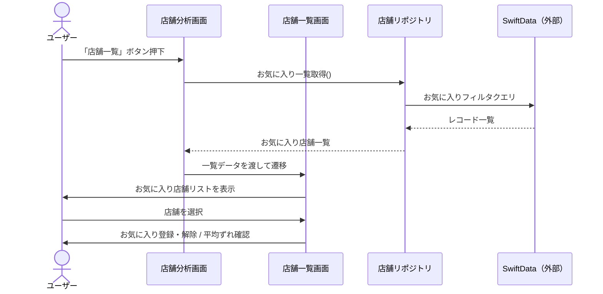

# F03 店舗分析 - 分析シーケンス図

## 店舗登録

```mermaid
sequenceDiagram
    actor ユーザー
    participant 店舗分析画面
    participant MapKit（インフラ）
    participant 店舗分析サービス
    participant 店舗リポジトリ
    participant SwiftData（外部）

    ユーザー->>店舗分析画面: キーワードで店舗を検索
    店舗分析画面->>MapKit（インフラ）: MKLocalSearchCompleter / MKLocalSearch で検索
    MapKit（インフラ）-->>店舗分析画面: 検索結果一覧（店舗名・座標）
    店舗分析画面->>ユーザー: 検索結果を表示
    ユーザー->>店舗分析画面: 店舗を選択
    店舗分析画面->>ユーザー: 店舗詳細シートを表示（.sheet）
    ユーザー->>店舗分析画面: 「取扱店舗として登録」を押下
    店舗分析画面->>店舗分析サービス: 店舗登録(店舗名, 緯度, 経度)
    店舗分析サービス->>店舗リポジトリ: 保存(店舗)
    店舗リポジトリ->>SwiftData（外部）: ModelContext.insert / save()
    SwiftData（外部）-->>店舗リポジトリ: 完了
    店舗リポジトリ-->>店舗分析サービス: 保存完了
    店舗分析サービス-->>店舗分析画面: 登録完了
    店舗分析画面->>ユーザー: マップにピンを表示
```

---

## 店舗詳細表示

```mermaid
sequenceDiagram
    actor ユーザー
    participant 店舗分析画面
    participant 店舗詳細シート
    participant 店舗リポジトリ
    participant SwiftData（外部）

    ユーザー->>店舗分析画面: マップのピンまたは店舗名をタップ
    店舗分析画面->>店舗リポジトリ: ID検索(店舗ID)
    店舗リポジトリ->>SwiftData（外部）: FetchDescriptor + id predicate
    SwiftData（外部）-->>店舗リポジトリ: レコード
    店舗リポジトリ-->>店舗分析画面: 店舗（平均ずれ時間含む）
    店舗分析画面->>店舗詳細シート: 店舗情報を渡して表示（.sheet）
    店舗詳細シート->>ユーザー: 店舗基本情報・平均ずれ時間を表示
```

---

## お気に入り登録・解除

```mermaid
sequenceDiagram
    actor ユーザー
    participant 店舗詳細シート
    participant 店舗分析サービス
    participant 店舗リポジトリ
    participant SwiftData（外部）

    ユーザー->>店舗詳細シート: お気に入りボタンを押下
    店舗詳細シート->>店舗分析サービス: お気に入り切替(店舗ID)
    店舗分析サービス->>店舗リポジトリ: ID検索(店舗ID)
    店舗リポジトリ->>SwiftData（外部）: FetchDescriptor + id predicate
    SwiftData（外部）-->>店舗リポジトリ: レコード
    店舗リポジトリ-->>店舗分析サービス: 店舗
    店舗分析サービス->>店舗分析サービス: お気に入りフラグを反転
    店舗分析サービス->>店舗リポジトリ: 保存(店舗)
    店舗リポジトリ->>SwiftData（外部）: ModelContext.save()
    SwiftData（外部）-->>店舗リポジトリ: 完了
    店舗リポジトリ-->>店舗分析サービス: 保存完了
    店舗分析サービス-->>店舗詳細シート: 更新完了
    店舗詳細シート->>ユーザー: ボタン状態を更新、マップにマーク表示
```

---

## 店舗一覧表示

```mermaid
sequenceDiagram
    actor ユーザー
    participant 店舗分析画面
    participant 店舗一覧画面
    participant 店舗リポジトリ
    participant SwiftData（外部）

    ユーザー->>店舗分析画面: 「店舗一覧」ボタン押下
    店舗分析画面->>店舗リポジトリ: お気に入り一覧取得()
    店舗リポジトリ->>SwiftData（外部）: お気に入りフィルタクエリ
    SwiftData（外部）-->>店舗リポジトリ: レコード一覧
    店舗リポジトリ-->>店舗分析画面: お気に入り店舗一覧
    店舗分析画面->>店舗一覧画面: 一覧データを渡して遷移
    店舗一覧画面->>ユーザー: お気に入り店舗リストを表示
    ユーザー->>店舗一覧画面: 店舗を選択
    店舗一覧画面->>ユーザー: お気に入り登録・解除 / 平均ずれ確認
```
