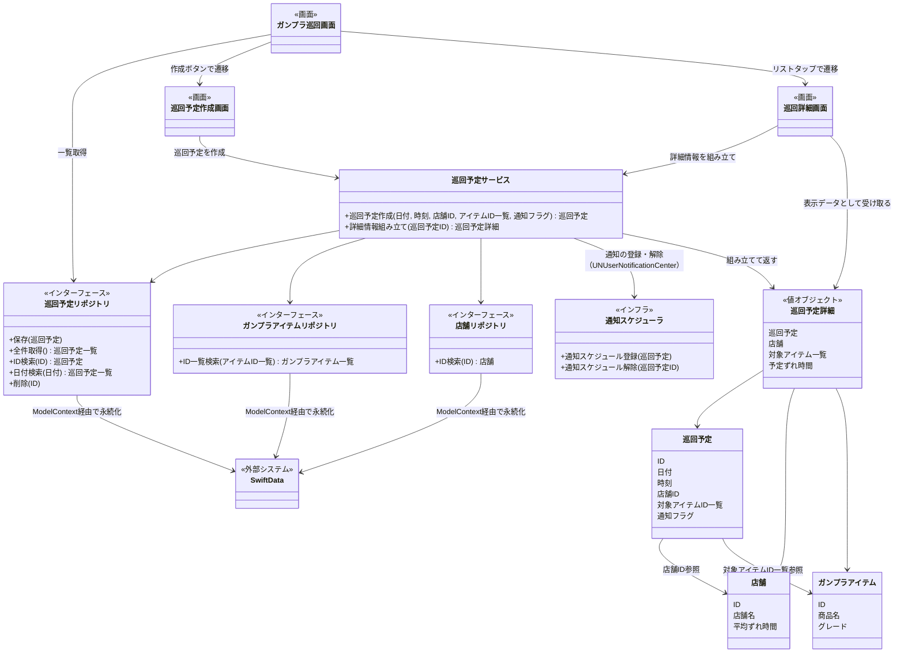

# F04 ガンプラ巡回 - 分析クラス図

```mermaid
classDiagram
    class ガンプラ巡回画面 {
        <<画面>>
    }

    class 巡回予定作成画面 {
        <<画面>>
    }

    class 巡回詳細画面 {
        <<画面>>
    }

    class 巡回予定 {
        ID
        日付
        時刻
        店舗ID
        対象アイテムID一覧
        通知フラグ
    }

    class 巡回予定詳細 {
        <<値オブジェクト>>
        巡回予定
        店舗
        対象アイテム一覧
        予定ずれ時間
    }

    class 巡回予定サービス {
        +巡回予定作成(日付, 時刻, 店舗ID, アイテムID一覧, 通知フラグ) 巡回予定
        +詳細情報組み立て(巡回予定ID) 巡回予定詳細
    }

    class 巡回予定リポジトリ {
        <<インターフェース>>
        +保存(巡回予定)
        +全件取得() 巡回予定一覧
        +ID検索(ID) 巡回予定
        +日付検索(日付) 巡回予定一覧
        +削除(ID)
    }

    class ガンプラアイテムリポジトリ {
        <<インターフェース>>
        +ID一覧検索(アイテムID一覧) ガンプラアイテム一覧
    }

    class 店舗リポジトリ {
        <<インターフェース>>
        +ID検索(ID) 店舗
    }

    class 通知スケジューラ {
        <<インフラ>>
        +通知スケジュール登録(巡回予定)
        +通知スケジュール解除(巡回予定ID)
    }

    class 店舗 {
        ID
        店舗名
        平均ずれ時間
    }

    class ガンプラアイテム {
        ID
        商品名
        グレード
    }

    class SwiftData {
        <<外部システム>>
    }

    ガンプラ巡回画面 --> 巡回予定リポジトリ : 一覧取得
    ガンプラ巡回画面 --> 巡回予定作成画面 : 作成ボタンで遷移
    ガンプラ巡回画面 --> 巡回詳細画面 : リストタップで遷移
    巡回予定作成画面 --> 巡回予定サービス : 巡回予定を作成
    巡回詳細画面 --> 巡回予定サービス : 詳細情報を組み立て
    巡回詳細画面 --> 巡回予定詳細 : 表示データとして受け取る

    巡回予定詳細 --> 巡回予定
    巡回予定詳細 --> 店舗
    巡回予定詳細 --> ガンプラアイテム
    巡回予定 --> 店舗 : 店舗ID参照
    巡回予定 --> ガンプラアイテム : 対象アイテムID一覧参照
    巡回予定サービス --> 巡回予定リポジトリ
    巡回予定サービス --> ガンプラアイテムリポジトリ
    巡回予定サービス --> 店舗リポジトリ
    巡回予定サービス --> 通知スケジューラ : 通知の登録・解除（UNUserNotificationCenter）
    巡回予定サービス --> 巡回予定詳細 : 組み立てて返す
    ガンプラアイテムリポジトリ --> SwiftData : ModelContext経由で永続化
    店舗リポジトリ --> SwiftData : ModelContext経由で永続化
    巡回予定リポジトリ --> SwiftData : ModelContext経由で永続化
```
