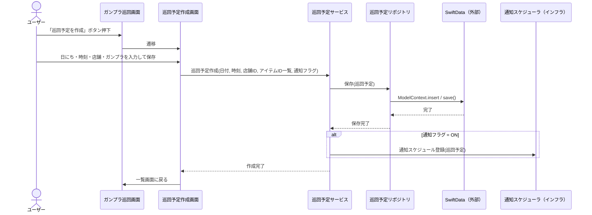
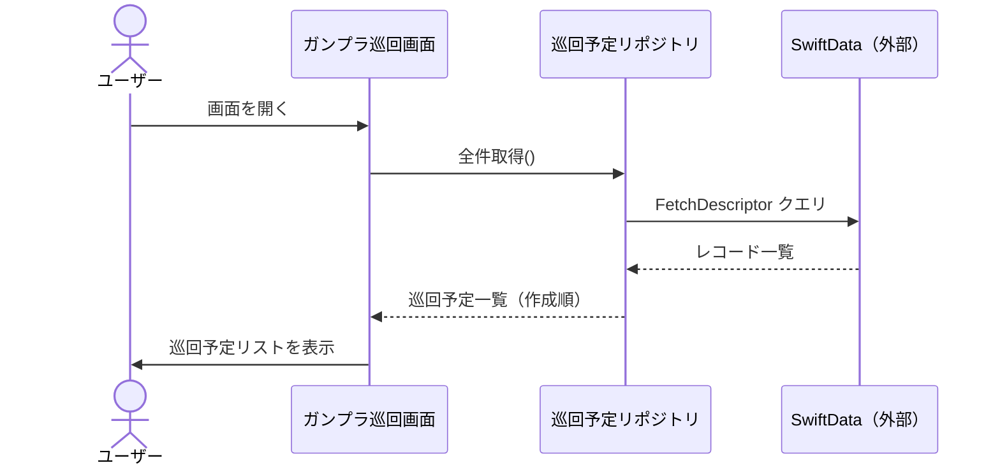
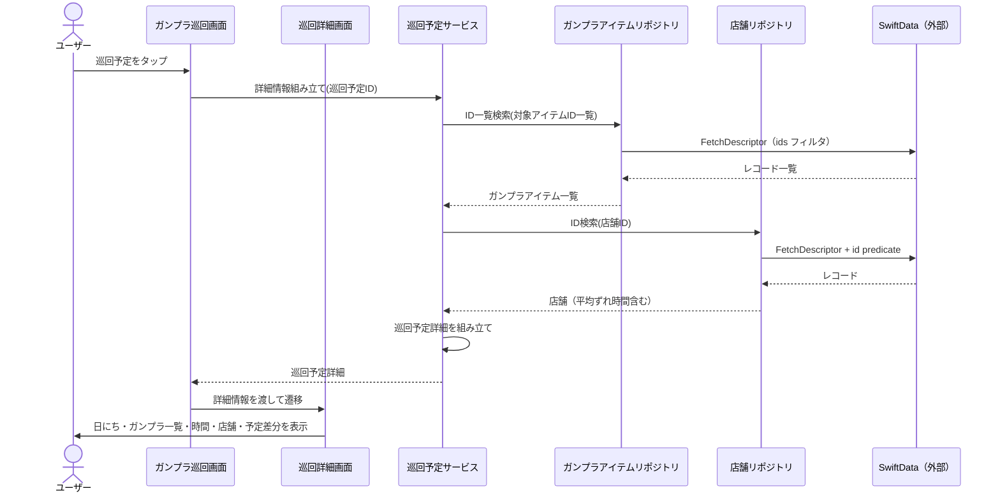

# F04 ガンプラ巡回 - 分析シーケンス図

## 巡回予定の作成

```mermaid
sequenceDiagram
    actor ユーザー
    participant ガンプラ巡回画面
    participant 巡回予定作成画面
    participant 巡回予定サービス
    participant 巡回予定リポジトリ
    participant SwiftData（外部）
    participant 通知スケジューラ（インフラ）

    ユーザー->>ガンプラ巡回画面: 「巡回予定を作成」ボタン押下
    ガンプラ巡回画面->>巡回予定作成画面: 遷移
    ユーザー->>巡回予定作成画面: 日にち・時刻・店舗・ガンプラを入力して保存
    巡回予定作成画面->>巡回予定サービス: 巡回予定作成(日付, 時刻, 店舗ID, アイテムID一覧, 通知フラグ)
    巡回予定サービス->>巡回予定リポジトリ: 保存(巡回予定)
    巡回予定リポジトリ->>SwiftData（外部）: ModelContext.insert / save()
    SwiftData（外部）-->>巡回予定リポジトリ: 完了
    巡回予定リポジトリ-->>巡回予定サービス: 保存完了
    alt 通知フラグ = ON
        巡回予定サービス->>通知スケジューラ（インフラ）: 通知スケジュール登録(巡回予定)
    end
    巡回予定サービス-->>巡回予定作成画面: 作成完了
    巡回予定作成画面->>ガンプラ巡回画面: 一覧画面に戻る
```

---

## 巡回一覧表示

```mermaid
sequenceDiagram
    actor ユーザー
    participant ガンプラ巡回画面
    participant 巡回予定リポジトリ
    participant SwiftData（外部）

    ユーザー->>ガンプラ巡回画面: 画面を開く
    ガンプラ巡回画面->>巡回予定リポジトリ: 全件取得()
    巡回予定リポジトリ->>SwiftData（外部）: FetchDescriptor クエリ
    SwiftData（外部）-->>巡回予定リポジトリ: レコード一覧
    巡回予定リポジトリ-->>ガンプラ巡回画面: 巡回予定一覧（作成順）
    ガンプラ巡回画面->>ユーザー: 巡回予定リストを表示
```

---

## 巡回詳細表示

```mermaid
sequenceDiagram
    actor ユーザー
    participant ガンプラ巡回画面
    participant 巡回詳細画面
    participant 巡回予定サービス
    participant ガンプラアイテムリポジトリ
    participant 店舗リポジトリ
    participant SwiftData（外部）

    ユーザー->>ガンプラ巡回画面: 巡回予定をタップ
    ガンプラ巡回画面->>巡回予定サービス: 詳細情報組み立て(巡回予定ID)
    巡回予定サービス->>ガンプラアイテムリポジトリ: ID一覧検索(対象アイテムID一覧)
    ガンプラアイテムリポジトリ->>SwiftData（外部）: FetchDescriptor（ids フィルタ）
    SwiftData（外部）-->>ガンプラアイテムリポジトリ: レコード一覧
    ガンプラアイテムリポジトリ-->>巡回予定サービス: ガンプラアイテム一覧
    巡回予定サービス->>店舗リポジトリ: ID検索(店舗ID)
    店舗リポジトリ->>SwiftData（外部）: FetchDescriptor + id predicate
    SwiftData（外部）-->>店舗リポジトリ: レコード
    店舗リポジトリ-->>巡回予定サービス: 店舗（平均ずれ時間含む）
    巡回予定サービス->>巡回予定サービス: 巡回予定詳細を組み立て
    巡回予定サービス-->>ガンプラ巡回画面: 巡回予定詳細
    ガンプラ巡回画面->>巡回詳細画面: 詳細情報を渡して遷移
    巡回詳細画面->>ユーザー: 日にち・ガンプラ一覧・時間・店舗・予定差分を表示
```
