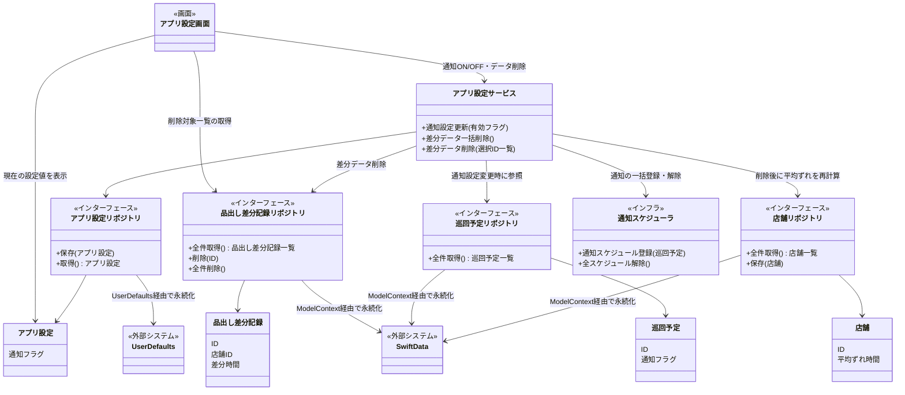

# F05 アプリ設定 - 分析クラス図

```mermaid
classDiagram
    class アプリ設定画面 {
        <<画面>>
    }

    class アプリ設定 {
        通知フラグ
    }

    class アプリ設定サービス {
        +通知設定更新(有効フラグ)
        +差分データ一括削除()
        +差分データ削除(選択ID一覧)
    }

    class アプリ設定リポジトリ {
        <<インターフェース>>
        +保存(アプリ設定)
        +取得() アプリ設定
    }

    class 品出し差分記録リポジトリ {
        <<インターフェース>>
        +全件取得() 品出し差分記録一覧
        +削除(ID)
        +全件削除()
    }

    class 巡回予定リポジトリ {
        <<インターフェース>>
        +全件取得() 巡回予定一覧
    }

    class 店舗リポジトリ {
        <<インターフェース>>
        +全件取得() 店舗一覧
        +保存(店舗)
    }

    class 通知スケジューラ {
        <<インフラ>>
        +通知スケジュール登録(巡回予定)
        +全スケジュール解除()
    }

    class 品出し差分記録 {
        ID
        店舗ID
        差分時間
    }

    class 巡回予定 {
        ID
        通知フラグ
    }

    class 店舗 {
        ID
        平均ずれ時間
    }

    class UserDefaults {
        <<外部システム>>
    }

    class SwiftData {
        <<外部システム>>
    }

    アプリ設定画面 --> アプリ設定サービス : 通知ON/OFF・データ削除
    アプリ設定画面 --> アプリ設定 : 現在の設定値を表示
    アプリ設定画面 --> 品出し差分記録リポジトリ : 削除対象一覧の取得

    アプリ設定サービス --> アプリ設定リポジトリ
    アプリ設定サービス --> 品出し差分記録リポジトリ : 差分データ削除
    アプリ設定サービス --> 巡回予定リポジトリ : 通知設定変更時に参照
    アプリ設定サービス --> 店舗リポジトリ : 削除後に平均ずれを再計算
    アプリ設定サービス --> 通知スケジューラ : 通知の一括登録・解除
    アプリ設定リポジトリ --> アプリ設定
    品出し差分記録リポジトリ --> 品出し差分記録
    巡回予定リポジトリ --> 巡回予定
    店舗リポジトリ --> 店舗
    アプリ設定リポジトリ --> UserDefaults : UserDefaults経由で永続化
    品出し差分記録リポジトリ --> SwiftData : ModelContext経由で永続化
    巡回予定リポジトリ --> SwiftData : ModelContext経由で永続化
    店舗リポジトリ --> SwiftData : ModelContext経由で永続化
```
