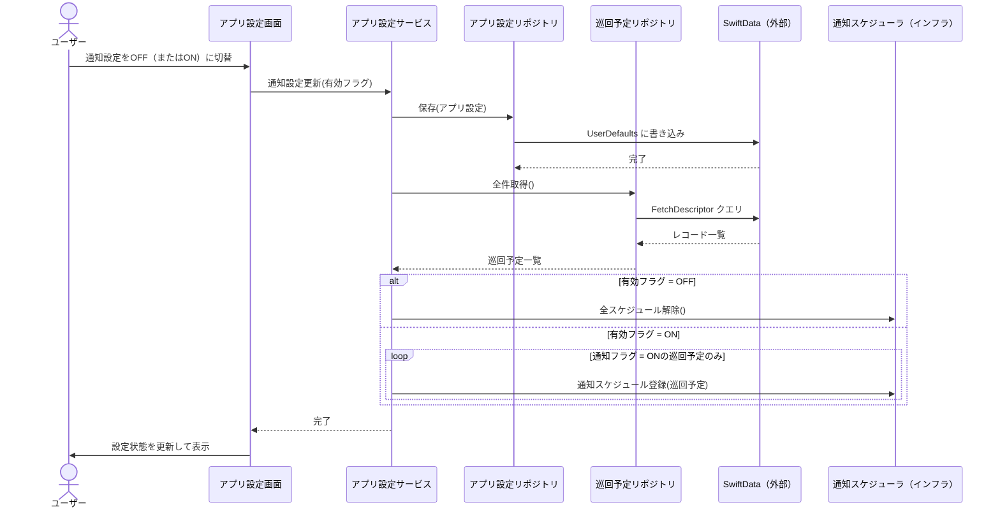
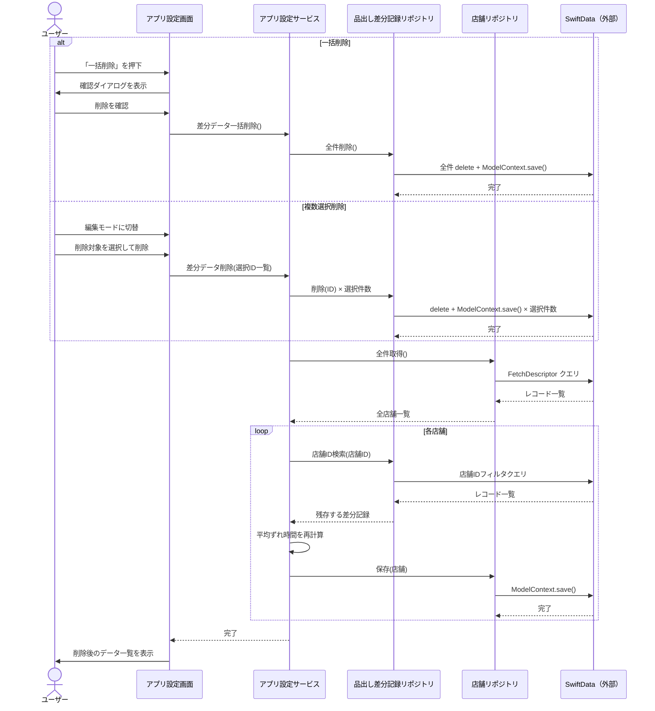

# F05 アプリ設定 - 分析シーケンス図

## 通知設定の変更

```mermaid
sequenceDiagram
    actor ユーザー
    participant アプリ設定画面
    participant アプリ設定サービス
    participant アプリ設定リポジトリ
    participant 巡回予定リポジトリ
    participant SwiftData（外部）
    participant 通知スケジューラ（インフラ）

    ユーザー->>アプリ設定画面: 通知設定をOFF（またはON）に切替
    アプリ設定画面->>アプリ設定サービス: 通知設定更新(有効フラグ)
    アプリ設定サービス->>アプリ設定リポジトリ: 保存(アプリ設定)
    アプリ設定リポジトリ->>SwiftData（外部）: UserDefaults に書き込み
    SwiftData（外部）-->>アプリ設定リポジトリ: 完了
    アプリ設定サービス->>巡回予定リポジトリ: 全件取得()
    巡回予定リポジトリ->>SwiftData（外部）: FetchDescriptor クエリ
    SwiftData（外部）-->>巡回予定リポジトリ: レコード一覧
    巡回予定リポジトリ-->>アプリ設定サービス: 巡回予定一覧

    alt 有効フラグ = OFF
        アプリ設定サービス->>通知スケジューラ（インフラ）: 全スケジュール解除()
    else 有効フラグ = ON
        loop 通知フラグ = ONの巡回予定のみ
            アプリ設定サービス->>通知スケジューラ（インフラ）: 通知スケジュール登録(巡回予定)
        end
    end

    アプリ設定サービス-->>アプリ設定画面: 完了
    アプリ設定画面->>ユーザー: 設定状態を更新して表示
```

---

## 蓄積データの削除

```mermaid
sequenceDiagram
    actor ユーザー
    participant アプリ設定画面
    participant アプリ設定サービス
    participant 品出し差分記録リポジトリ
    participant 店舗リポジトリ
    participant SwiftData（外部）

    alt 一括削除
        ユーザー->>アプリ設定画面: 「一括削除」を押下
        アプリ設定画面->>ユーザー: 確認ダイアログを表示
        ユーザー->>アプリ設定画面: 削除を確認
        アプリ設定画面->>アプリ設定サービス: 差分データ一括削除()
        アプリ設定サービス->>品出し差分記録リポジトリ: 全件削除()
        品出し差分記録リポジトリ->>SwiftData（外部）: 全件 delete + ModelContext.save()
        SwiftData（外部）-->>品出し差分記録リポジトリ: 完了
    else 複数選択削除
        ユーザー->>アプリ設定画面: 編集モードに切替
        ユーザー->>アプリ設定画面: 削除対象を選択して削除
        アプリ設定画面->>アプリ設定サービス: 差分データ削除(選択ID一覧)
        アプリ設定サービス->>品出し差分記録リポジトリ: 削除(ID) × 選択件数
        品出し差分記録リポジトリ->>SwiftData（外部）: delete + ModelContext.save() × 選択件数
        SwiftData（外部）-->>品出し差分記録リポジトリ: 完了
    end

    アプリ設定サービス->>店舗リポジトリ: 全件取得()
    店舗リポジトリ->>SwiftData（外部）: FetchDescriptor クエリ
    SwiftData（外部）-->>店舗リポジトリ: レコード一覧
    店舗リポジトリ-->>アプリ設定サービス: 全店舗一覧
    loop 各店舗
        アプリ設定サービス->>品出し差分記録リポジトリ: 店舗ID検索(店舗ID)
        品出し差分記録リポジトリ->>SwiftData（外部）: 店舗IDフィルタクエリ
        SwiftData（外部）-->>品出し差分記録リポジトリ: レコード一覧
        品出し差分記録リポジトリ-->>アプリ設定サービス: 残存する差分記録
        アプリ設定サービス->>アプリ設定サービス: 平均ずれ時間を再計算
        アプリ設定サービス->>店舗リポジトリ: 保存(店舗)
        店舗リポジトリ->>SwiftData（外部）: ModelContext.save()
        SwiftData（外部）-->>店舗リポジトリ: 完了
    end

    アプリ設定サービス-->>アプリ設定画面: 完了
    アプリ設定画面->>ユーザー: 削除後のデータ一覧を表示
```
