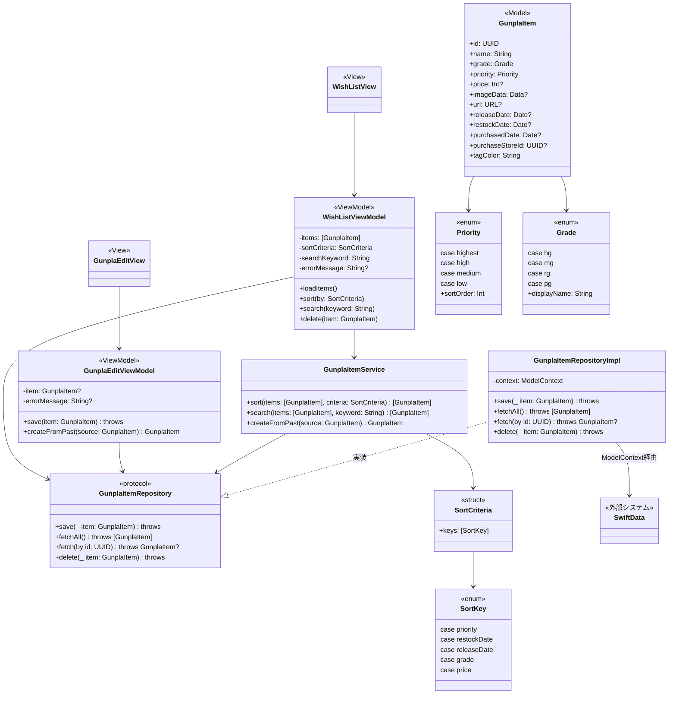

# F01 ほしい物リスト - 詳細クラス図

```mermaid
classDiagram
    class WishListView {
        <<View>>
    }

    class GunplaEditView {
        <<View>>
    }

    class WishListViewModel {
        <<ViewModel>>
        -items: [GunplaItem]
        -sortCriteria: SortCriteria
        -searchKeyword: String
        -errorMessage: String?
        +loadItems()
        +sort(by: SortCriteria)
        +search(keyword: String)
        +delete(item: GunplaItem)
    }

    class GunplaEditViewModel {
        <<ViewModel>>
        -item: GunplaItem?
        -errorMessage: String?
        +save(item: GunplaItem) throws
        +createFromPast(source: GunplaItem) GunplaItem
    }

    class GunplaItemService {
        +sort(items: [GunplaItem], criteria: SortCriteria) [GunplaItem]
        +search(items: [GunplaItem], keyword: String) [GunplaItem]
        +createFromPast(source: GunplaItem) GunplaItem
    }

    class GunplaItemRepository {
        <<protocol>>
        +save(_ item: GunplaItem) throws
        +fetchAll() throws [GunplaItem]
        +fetch(by id: UUID) throws GunplaItem?
        +delete(_ item: GunplaItem) throws
    }

    class GunplaItemRepositoryImpl {
        -context: ModelContext
        +save(_ item: GunplaItem) throws
        +fetchAll() throws [GunplaItem]
        +fetch(by id: UUID) throws GunplaItem?
        +delete(_ item: GunplaItem) throws
    }

    class GunplaItem {
        <<Model>>
        +id: UUID
        +name: String
        +grade: Grade
        +priority: Priority
        +price: Int?
        +imageData: Data?
        +url: URL?
        +releaseDate: Date?
        +restockDate: Date?
        +purchasedDate: Date?
        +purchaseStoreId: UUID?
        +tagColor: String
    }

    class Priority {
        <<enum>>
        case highest
        case high
        case medium
        case low
        +sortOrder: Int
    }

    class Grade {
        <<enum>>
        case hg
        case mg
        case rg
        case pg
        +displayName: String
    }

    class SortCriteria {
        <<struct>>
        +keys: [SortKey]
    }

    class SortKey {
        <<enum>>
        case priority
        case restockDate
        case releaseDate
        case grade
        case price
    }

    class SwiftData {
        <<外部システム>>
    }

    WishListView --> WishListViewModel
    GunplaEditView --> GunplaEditViewModel
    WishListViewModel --> GunplaItemService
    WishListViewModel --> GunplaItemRepository
    GunplaEditViewModel --> GunplaItemRepository
    GunplaItemService --> GunplaItemRepository
    GunplaItemService --> SortCriteria
    GunplaItemRepositoryImpl ..|> GunplaItemRepository : 実装
    GunplaItemRepositoryImpl --> SwiftData : ModelContext経由
    GunplaItem --> Priority
    GunplaItem --> Grade
    SortCriteria --> SortKey
```
