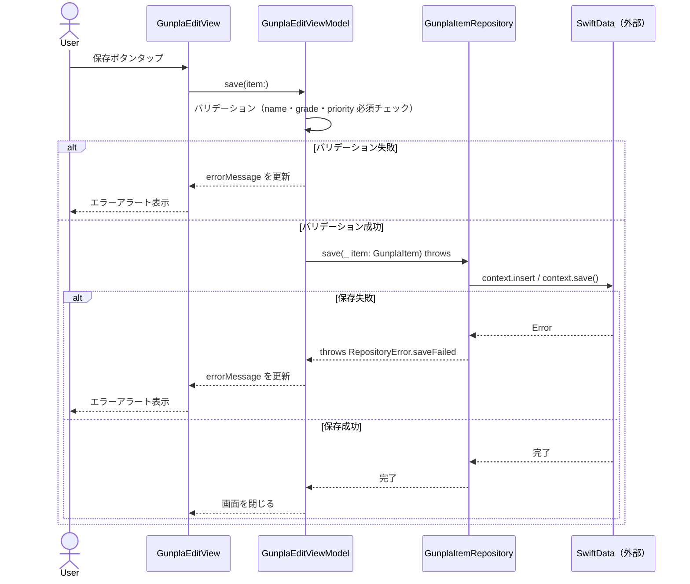
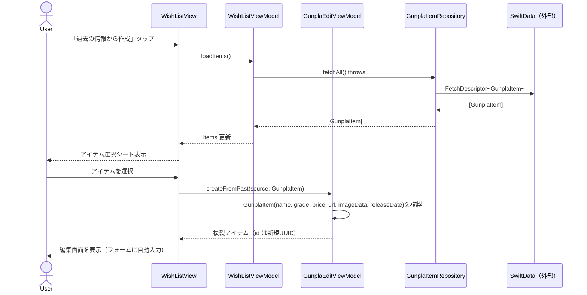
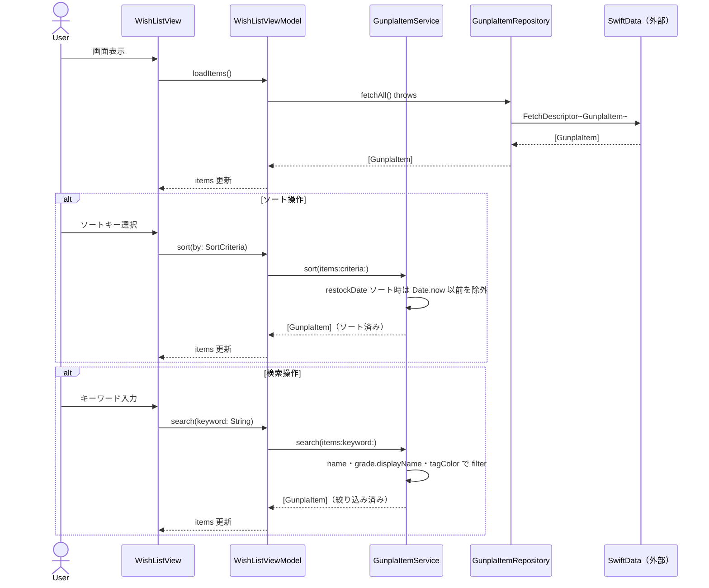

# F01 ほしい物リスト - 詳細シーケンス図

## 新規登録

```mermaid
sequenceDiagram
    actor User
    participant GunplaEditView
    participant GunplaEditViewModel
    participant GunplaItemRepository
    participant SwiftData（外部）

    User->>GunplaEditView: 保存ボタンタップ
    GunplaEditView->>GunplaEditViewModel: save(item:)
    GunplaEditViewModel->>GunplaEditViewModel: バリデーション（name・grade・priority 必須チェック）

    alt バリデーション失敗
        GunplaEditViewModel-->>GunplaEditView: errorMessage を更新
        GunplaEditView-->>User: エラーアラート表示
    else バリデーション成功
        GunplaEditViewModel->>GunplaItemRepository: save(_ item: GunplaItem) throws
        GunplaItemRepository->>SwiftData（外部）: context.insert / context.save()
        alt 保存失敗
            SwiftData（外部）-->>GunplaItemRepository: Error
            GunplaItemRepository-->>GunplaEditViewModel: throws RepositoryError.saveFailed
            GunplaEditViewModel-->>GunplaEditView: errorMessage を更新
            GunplaEditView-->>User: エラーアラート表示
        else 保存成功
            SwiftData（外部）-->>GunplaItemRepository: 完了
            GunplaItemRepository-->>GunplaEditViewModel: 完了
            GunplaEditViewModel-->>GunplaEditView: 画面を閉じる
        end
    end
```

---

## 過去情報からの作成

```mermaid
sequenceDiagram
    actor User
    participant WishListView
    participant WishListViewModel
    participant GunplaEditViewModel
    participant GunplaItemRepository
    participant SwiftData（外部）

    User->>WishListView: 「過去の情報から作成」タップ
    WishListView->>WishListViewModel: loadItems()
    WishListViewModel->>GunplaItemRepository: fetchAll() throws
    GunplaItemRepository->>SwiftData（外部）: FetchDescriptor~GunplaItem~
    SwiftData（外部）-->>GunplaItemRepository: [GunplaItem]
    GunplaItemRepository-->>WishListViewModel: [GunplaItem]
    WishListViewModel-->>WishListView: items 更新
    WishListView-->>User: アイテム選択シート表示
    User->>WishListView: アイテムを選択
    WishListView->>GunplaEditViewModel: createFromPast(source: GunplaItem)
    GunplaEditViewModel->>GunplaEditViewModel: GunplaItem(name, grade, price, url, imageData, releaseDate)を複製
    GunplaEditViewModel-->>WishListView: 複製アイテム（id は新規UUID）
    WishListView-->>User: 編集画面を表示（フォームに自動入力）
```

---

## ソート・検索

```mermaid
sequenceDiagram
    actor User
    participant WishListView
    participant WishListViewModel
    participant GunplaItemService
    participant GunplaItemRepository
    participant SwiftData（外部）

    User->>WishListView: 画面表示
    WishListView->>WishListViewModel: loadItems()
    WishListViewModel->>GunplaItemRepository: fetchAll() throws
    GunplaItemRepository->>SwiftData（外部）: FetchDescriptor~GunplaItem~
    SwiftData（外部）-->>GunplaItemRepository: [GunplaItem]
    GunplaItemRepository-->>WishListViewModel: [GunplaItem]
    WishListViewModel-->>WishListView: items 更新

    alt ソート操作
        User->>WishListView: ソートキー選択
        WishListView->>WishListViewModel: sort(by: SortCriteria)
        WishListViewModel->>GunplaItemService: sort(items:criteria:)
        GunplaItemService->>GunplaItemService: restockDate ソート時は Date.now 以前を除外
        GunplaItemService-->>WishListViewModel: [GunplaItem]（ソート済み）
        WishListViewModel-->>WishListView: items 更新
    end

    alt 検索操作
        User->>WishListView: キーワード入力
        WishListView->>WishListViewModel: search(keyword: String)
        WishListViewModel->>GunplaItemService: search(items:keyword:)
        GunplaItemService->>GunplaItemService: name・grade.displayName・tagColor で filter
        GunplaItemService-->>WishListViewModel: [GunplaItem]（絞り込み済み）
        WishListViewModel-->>WishListView: items 更新
    end
```
