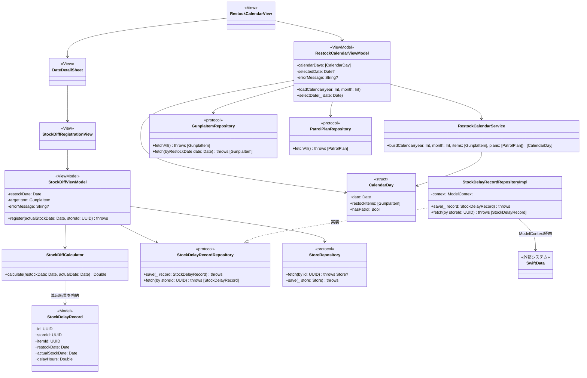

# F02 再販カレンダー - 詳細クラス図

```mermaid
classDiagram
    class RestockCalendarView {
        <<View>>
    }

    class DateDetailSheet {
        <<View>>
    }

    class StockDiffRegistrationView {
        <<View>>
    }

    class RestockCalendarViewModel {
        <<ViewModel>>
        -calendarDays: [CalendarDay]
        -selectedDate: Date?
        -errorMessage: String?
        +loadCalendar(year: Int, month: Int)
        +selectDate(_ date: Date)
    }

    class StockDiffViewModel {
        <<ViewModel>>
        -restockDate: Date
        -targetItem: GunplaItem
        -errorMessage: String?
        +register(actualStockDate: Date, storeId: UUID) throws
    }

    class RestockCalendarService {
        +buildCalendar(year: Int, month: Int, items: [GunplaItem], plans: [PatrolPlan]) [CalendarDay]
    }

    class StockDiffCalculator {
        +calculate(restockDate: Date, actualDate: Date) Double
    }

    class CalendarDay {
        <<struct>>
        +date: Date
        +restockItems: [GunplaItem]
        +hasPatrol: Bool
    }

    class StockDelayRecord {
        <<Model>>
        +id: UUID
        +storeId: UUID
        +itemId: UUID
        +restockDate: Date
        +actualStockDate: Date
        +delayHours: Double
    }

    class GunplaItemRepository {
        <<protocol>>
        +fetchAll() throws [GunplaItem]
        +fetch(byRestockDate date: Date) throws [GunplaItem]
    }

    class PatrolPlanRepository {
        <<protocol>>
        +fetchAll() throws [PatrolPlan]
    }

    class StockDelayRecordRepository {
        <<protocol>>
        +save(_ record: StockDelayRecord) throws
        +fetch(by storeId: UUID) throws [StockDelayRecord]
    }

    class StoreRepository {
        <<protocol>>
        +fetch(by id: UUID) throws Store?
        +save(_ store: Store) throws
    }

    class StockDelayRecordRepositoryImpl {
        -context: ModelContext
        +save(_ record: StockDelayRecord) throws
        +fetch(by storeId: UUID) throws [StockDelayRecord]
    }

    class SwiftData {
        <<外部システム>>
    }

    RestockCalendarView --> RestockCalendarViewModel
    RestockCalendarView --> DateDetailSheet
    DateDetailSheet --> StockDiffRegistrationView
    RestockCalendarViewModel --> RestockCalendarService
    RestockCalendarViewModel --> GunplaItemRepository
    RestockCalendarViewModel --> PatrolPlanRepository
    RestockCalendarViewModel --> CalendarDay
    StockDiffViewModel --> StockDiffCalculator
    StockDiffViewModel --> StockDelayRecordRepository
    StockDiffViewModel --> StoreRepository
    StockDiffRegistrationView --> StockDiffViewModel
    RestockCalendarService --> CalendarDay
    StockDiffCalculator --> StockDelayRecord : 算出結果を格納
    StockDelayRecordRepositoryImpl ..|> StockDelayRecordRepository : 実装
    StockDelayRecordRepositoryImpl --> SwiftData : ModelContext経由
```
