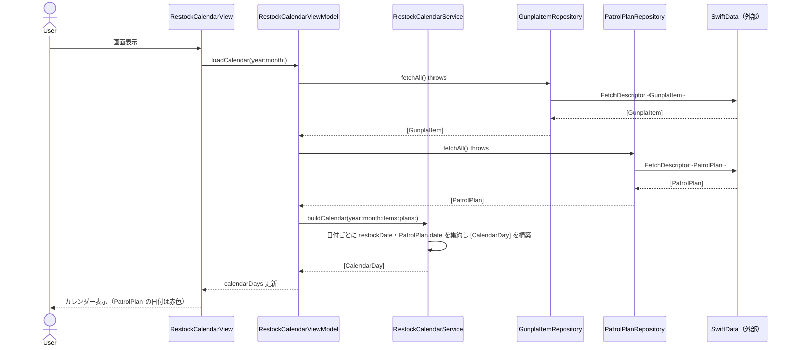
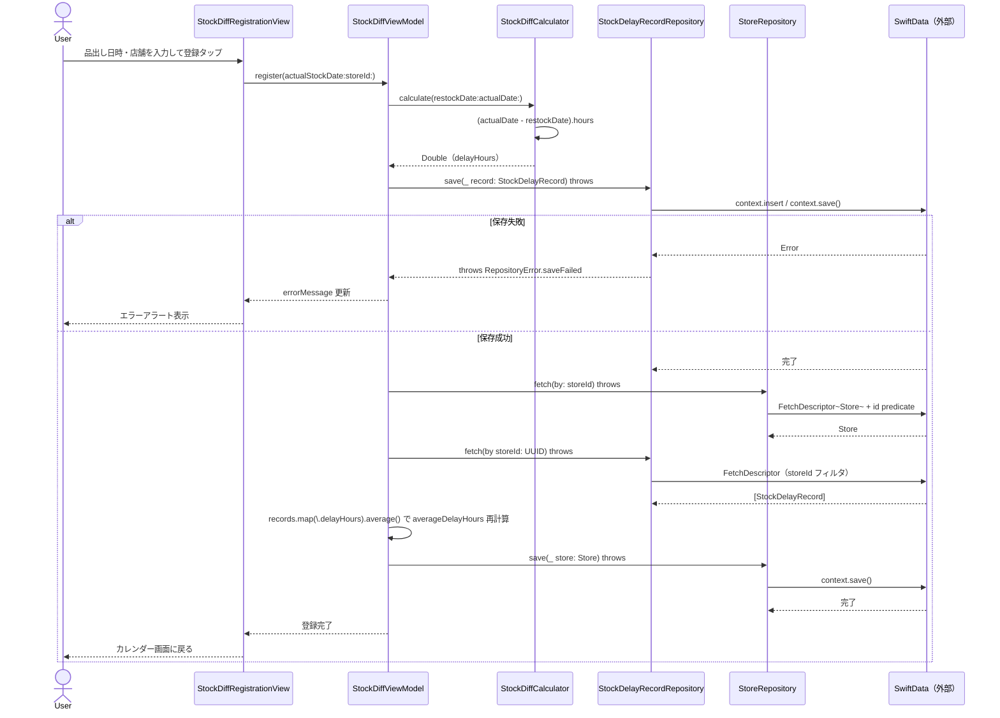

# F02 再販カレンダー - 詳細シーケンス図

## カレンダー表示

```mermaid
sequenceDiagram
    actor User
    participant RestockCalendarView
    participant RestockCalendarViewModel
    participant RestockCalendarService
    participant GunplaItemRepository
    participant PatrolPlanRepository
    participant SwiftData（外部）

    User->>RestockCalendarView: 画面表示
    RestockCalendarView->>RestockCalendarViewModel: loadCalendar(year:month:)
    RestockCalendarViewModel->>GunplaItemRepository: fetchAll() throws
    GunplaItemRepository->>SwiftData（外部）: FetchDescriptor~GunplaItem~
    SwiftData（外部）-->>GunplaItemRepository: [GunplaItem]
    GunplaItemRepository-->>RestockCalendarViewModel: [GunplaItem]
    RestockCalendarViewModel->>PatrolPlanRepository: fetchAll() throws
    PatrolPlanRepository->>SwiftData（外部）: FetchDescriptor~PatrolPlan~
    SwiftData（外部）-->>PatrolPlanRepository: [PatrolPlan]
    PatrolPlanRepository-->>RestockCalendarViewModel: [PatrolPlan]
    RestockCalendarViewModel->>RestockCalendarService: buildCalendar(year:month:items:plans:)
    RestockCalendarService->>RestockCalendarService: 日付ごとに restockDate・PatrolPlan.date を集約し [CalendarDay] を構築
    RestockCalendarService-->>RestockCalendarViewModel: [CalendarDay]
    RestockCalendarViewModel-->>RestockCalendarView: calendarDays 更新
    RestockCalendarView-->>User: カレンダー表示（PatrolPlan の日付は赤色）
```

---

## 品出し差分登録

```mermaid
sequenceDiagram
    actor User
    participant StockDiffRegistrationView
    participant StockDiffViewModel
    participant StockDiffCalculator
    participant StockDelayRecordRepository
    participant StoreRepository
    participant SwiftData（外部）

    User->>StockDiffRegistrationView: 品出し日時・店舗を入力して登録タップ
    StockDiffRegistrationView->>StockDiffViewModel: register(actualStockDate:storeId:)
    StockDiffViewModel->>StockDiffCalculator: calculate(restockDate:actualDate:)
    StockDiffCalculator->>StockDiffCalculator: (actualDate - restockDate).hours
    StockDiffCalculator-->>StockDiffViewModel: Double（delayHours）
    StockDiffViewModel->>StockDelayRecordRepository: save(_ record: StockDelayRecord) throws
    StockDelayRecordRepository->>SwiftData（外部）: context.insert / context.save()

    alt 保存失敗
        SwiftData（外部）-->>StockDelayRecordRepository: Error
        StockDelayRecordRepository-->>StockDiffViewModel: throws RepositoryError.saveFailed
        StockDiffViewModel-->>StockDiffRegistrationView: errorMessage 更新
        StockDiffRegistrationView-->>User: エラーアラート表示
    else 保存成功
        SwiftData（外部）-->>StockDelayRecordRepository: 完了
        StockDiffViewModel->>StoreRepository: fetch(by: storeId) throws
        StoreRepository->>SwiftData（外部）: FetchDescriptor~Store~ + id predicate
        SwiftData（外部）-->>StoreRepository: Store
        StockDiffViewModel->>StockDelayRecordRepository: fetch(by storeId: UUID) throws
        StockDelayRecordRepository->>SwiftData（外部）: FetchDescriptor（storeId フィルタ）
        SwiftData（外部）-->>StockDelayRecordRepository: [StockDelayRecord]
        StockDiffViewModel->>StockDiffViewModel: records.map(\.delayHours).average() で averageDelayHours 再計算
        StockDiffViewModel->>StoreRepository: save(_ store: Store) throws
        StoreRepository->>SwiftData（外部）: context.save()
        SwiftData（外部）-->>StoreRepository: 完了
        StockDiffViewModel-->>StockDiffRegistrationView: 登録完了
        StockDiffRegistrationView-->>User: カレンダー画面に戻る
    end
```
