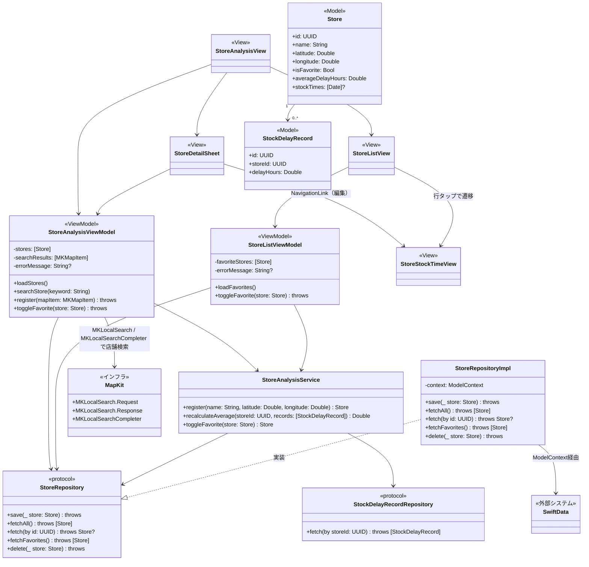

# F03 店舗分析 - 詳細クラス図

```mermaid
classDiagram
    class StoreAnalysisView {
        <<View>>
    }

    class StoreDetailSheet {
        <<View>>
    }

    class StoreListView {
        <<View>>
    }

    class StoreAnalysisViewModel {
        <<ViewModel>>
        -stores: [Store]
        -searchResults: [MKMapItem]
        -errorMessage: String?
        +loadStores()
        +searchStore(keyword: String)
        +register(mapItem: MKMapItem) throws
        +toggleFavorite(store: Store) throws
    }

    class StoreListViewModel {
        <<ViewModel>>
        -favoriteStores: [Store]
        -errorMessage: String?
        +loadFavorites()
        +toggleFavorite(store: Store) throws
    }

    class StoreAnalysisService {
        +register(name: String, latitude: Double, longitude: Double) Store
        +recalculateAverage(storeId: UUID, records: [StockDelayRecord]) Double
        +toggleFavorite(store: Store) Store
    }

    class StoreRepository {
        <<protocol>>
        +save(_ store: Store) throws
        +fetchAll() throws [Store]
        +fetch(by id: UUID) throws Store?
        +fetchFavorites() throws [Store]
        +delete(_ store: Store) throws
    }

    class StoreRepositoryImpl {
        -context: ModelContext
        +save(_ store: Store) throws
        +fetchAll() throws [Store]
        +fetch(by id: UUID) throws Store?
        +fetchFavorites() throws [Store]
        +delete(_ store: Store) throws
    }

    class StockDelayRecordRepository {
        <<protocol>>
        +fetch(by storeId: UUID) throws [StockDelayRecord]
    }

    class Store {
        <<Model>>
        +id: UUID
        +name: String
        +latitude: Double
        +longitude: Double
        +isFavorite: Bool
        +averageDelayHours: Double
        +stockTimes: [Date]?
    }

    class StoreStockTimeView {
        <<View>>
    }

    class StockDelayRecord {
        <<Model>>
        +id: UUID
        +storeId: UUID
        +delayHours: Double
    }

    class MapKit {
        <<インフラ>>
        +MKLocalSearch.Request
        +MKLocalSearch.Response
        +MKLocalSearchCompleter
    }

    class SwiftData {
        <<外部システム>>
    }

    StoreAnalysisView --> StoreAnalysisViewModel
    StoreAnalysisView --> StoreDetailSheet
    StoreAnalysisView --> StoreListView
    StoreListView --> StoreListViewModel
    StoreAnalysisViewModel --> StoreAnalysisService
    StoreAnalysisViewModel --> StoreRepository
    StoreAnalysisViewModel --> MapKit : MKLocalSearch / MKLocalSearchCompleter で店舗検索
    StoreDetailSheet --> StoreAnalysisViewModel
    StoreDetailSheet --> StoreStockTimeView : NavigationLink（編集）
    StoreListView --> StoreStockTimeView : 行タップで遷移
    StoreListViewModel --> StoreRepository
    StoreListViewModel --> StoreAnalysisService
    StoreAnalysisService --> StoreRepository
    StoreAnalysisService --> StockDelayRecordRepository
    Store "1" --> "0..*" StockDelayRecord
    StoreRepositoryImpl ..|> StoreRepository : 実装
    StoreRepositoryImpl --> SwiftData : ModelContext経由
```
