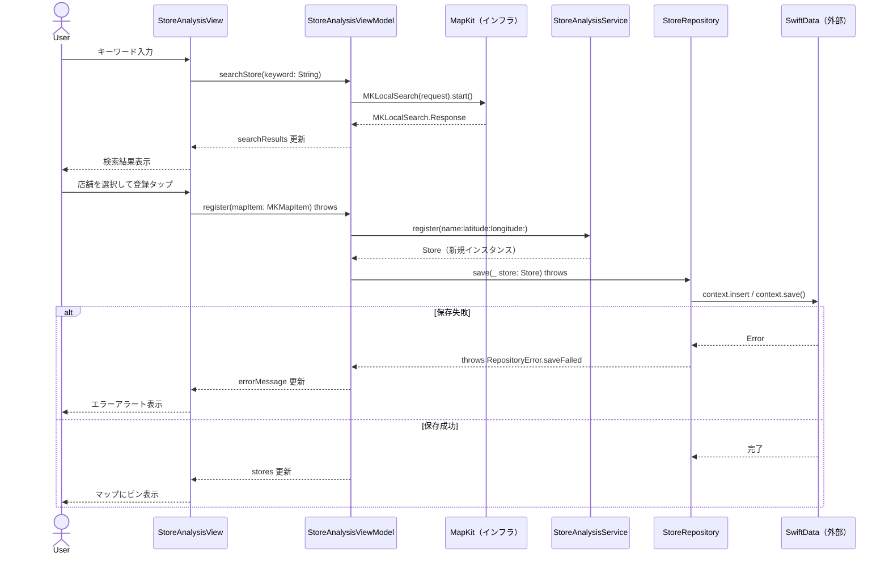
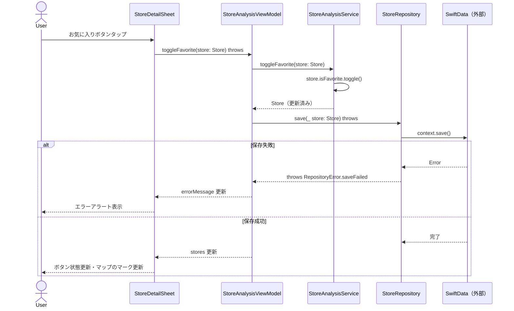

# F03 店舗分析 - 詳細シーケンス図

## 店舗検索・登録

```mermaid
sequenceDiagram
    actor User
    participant StoreAnalysisView
    participant StoreAnalysisViewModel
    participant MapKit（インフラ）
    participant StoreAnalysisService
    participant StoreRepository
    participant SwiftData（外部）

    User->>StoreAnalysisView: キーワード入力
    StoreAnalysisView->>StoreAnalysisViewModel: searchStore(keyword: String)
    StoreAnalysisViewModel->>MapKit（インフラ）: MKLocalSearch(request).start()
    MapKit（インフラ）-->>StoreAnalysisViewModel: MKLocalSearch.Response
    StoreAnalysisViewModel-->>StoreAnalysisView: searchResults 更新
    StoreAnalysisView-->>User: 検索結果表示

    User->>StoreAnalysisView: 店舗を選択して登録タップ
    StoreAnalysisView->>StoreAnalysisViewModel: register(mapItem: MKMapItem) throws
    StoreAnalysisViewModel->>StoreAnalysisService: register(name:latitude:longitude:)
    StoreAnalysisService-->>StoreAnalysisViewModel: Store（新規インスタンス）
    StoreAnalysisViewModel->>StoreRepository: save(_ store: Store) throws
    StoreRepository->>SwiftData（外部）: context.insert / context.save()

    alt 保存失敗
        SwiftData（外部）-->>StoreRepository: Error
        StoreRepository-->>StoreAnalysisViewModel: throws RepositoryError.saveFailed
        StoreAnalysisViewModel-->>StoreAnalysisView: errorMessage 更新
        StoreAnalysisView-->>User: エラーアラート表示
    else 保存成功
        SwiftData（外部）-->>StoreRepository: 完了
        StoreAnalysisViewModel-->>StoreAnalysisView: stores 更新
        StoreAnalysisView-->>User: マップにピン表示
    end
```

---

## お気に入り登録・解除

```mermaid
sequenceDiagram
    actor User
    participant StoreDetailSheet
    participant StoreAnalysisViewModel
    participant StoreAnalysisService
    participant StoreRepository
    participant SwiftData（外部）

    User->>StoreDetailSheet: お気に入りボタンタップ
    StoreDetailSheet->>StoreAnalysisViewModel: toggleFavorite(store: Store) throws
    StoreAnalysisViewModel->>StoreAnalysisService: toggleFavorite(store: Store)
    StoreAnalysisService->>StoreAnalysisService: store.isFavorite.toggle()
    StoreAnalysisService-->>StoreAnalysisViewModel: Store（更新済み）
    StoreAnalysisViewModel->>StoreRepository: save(_ store: Store) throws
    StoreRepository->>SwiftData（外部）: context.save()

    alt 保存失敗
        SwiftData（外部）-->>StoreRepository: Error
        StoreRepository-->>StoreAnalysisViewModel: throws RepositoryError.saveFailed
        StoreAnalysisViewModel-->>StoreDetailSheet: errorMessage 更新
        StoreDetailSheet-->>User: エラーアラート表示
    else 保存成功
        SwiftData（外部）-->>StoreRepository: 完了
        StoreAnalysisViewModel-->>StoreDetailSheet: stores 更新
        StoreDetailSheet-->>User: ボタン状態更新・マップのマーク更新
    end
```
