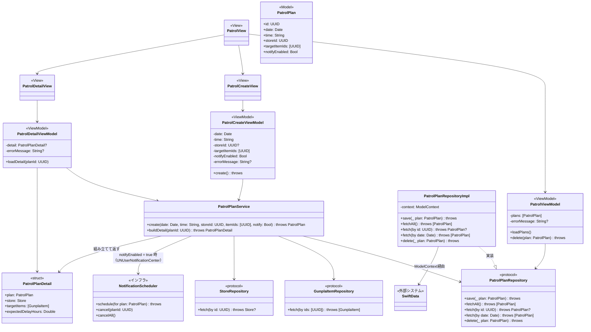

# F04 ガンプラ巡回 - 詳細クラス図

```mermaid
classDiagram
    class PatrolView {
        <<View>>
    }

    class PatrolCreateView {
        <<View>>
    }

    class PatrolDetailView {
        <<View>>
    }

    class PatrolViewModel {
        <<ViewModel>>
        -plans: [PatrolPlan]
        -errorMessage: String?
        +loadPlans()
        +delete(plan: PatrolPlan) throws
    }

    class PatrolCreateViewModel {
        <<ViewModel>>
        -date: Date
        -time: String
        -storeId: UUID?
        -targetItemIds: [UUID]
        -notifyEnabled: Bool
        -errorMessage: String?
        +create() throws
    }

    class PatrolDetailViewModel {
        <<ViewModel>>
        -detail: PatrolPlanDetail?
        -errorMessage: String?
        +loadDetail(planId: UUID)
    }

    class PatrolPlanService {
        +create(date: Date, time: String, storeId: UUID, itemIds: [UUID], notify: Bool) throws PatrolPlan
        +buildDetail(planId: UUID) throws PatrolPlanDetail
    }

    class PatrolPlanDetail {
        <<struct>>
        +plan: PatrolPlan
        +store: Store
        +targetItems: [GunplaItem]
        +expectedDelayHours: Double
    }

    class PatrolPlanRepository {
        <<protocol>>
        +save(_ plan: PatrolPlan) throws
        +fetchAll() throws [PatrolPlan]
        +fetch(by id: UUID) throws PatrolPlan?
        +fetch(by date: Date) throws [PatrolPlan]
        +delete(_ plan: PatrolPlan) throws
    }

    class PatrolPlanRepositoryImpl {
        -context: ModelContext
        +save(_ plan: PatrolPlan) throws
        +fetchAll() throws [PatrolPlan]
        +fetch(by id: UUID) throws PatrolPlan?
        +fetch(by date: Date) throws [PatrolPlan]
        +delete(_ plan: PatrolPlan) throws
    }

    class GunplaItemRepository {
        <<protocol>>
        +fetch(by ids: [UUID]) throws [GunplaItem]
    }

    class StoreRepository {
        <<protocol>>
        +fetch(by id: UUID) throws Store?
    }

    class PatrolPlan {
        <<Model>>
        +id: UUID
        +date: Date
        +time: String
        +storeId: UUID
        +targetItemIds: [UUID]
        +notifyEnabled: Bool
    }

    class NotificationScheduler {
        <<インフラ>>
        +schedule(for plan: PatrolPlan) throws
        +cancel(planId: UUID)
        +cancelAll()
    }

    class SwiftData {
        <<外部システム>>
    }

    PatrolView --> PatrolViewModel
    PatrolView --> PatrolCreateView
    PatrolView --> PatrolDetailView
    PatrolCreateView --> PatrolCreateViewModel
    PatrolDetailView --> PatrolDetailViewModel
    PatrolViewModel --> PatrolPlanRepository
    PatrolCreateViewModel --> PatrolPlanService
    PatrolDetailViewModel --> PatrolPlanService
    PatrolDetailViewModel --> PatrolPlanDetail
    PatrolPlanService --> PatrolPlanRepository
    PatrolPlanService --> GunplaItemRepository
    PatrolPlanService --> StoreRepository
    PatrolPlanService --> NotificationScheduler : notifyEnabled = true 時（UNUserNotificationCenter）
    PatrolPlanService --> PatrolPlanDetail : 組み立てて返す
    PatrolPlanRepositoryImpl ..|> PatrolPlanRepository : 実装
    PatrolPlanRepositoryImpl --> SwiftData : ModelContext経由
```
