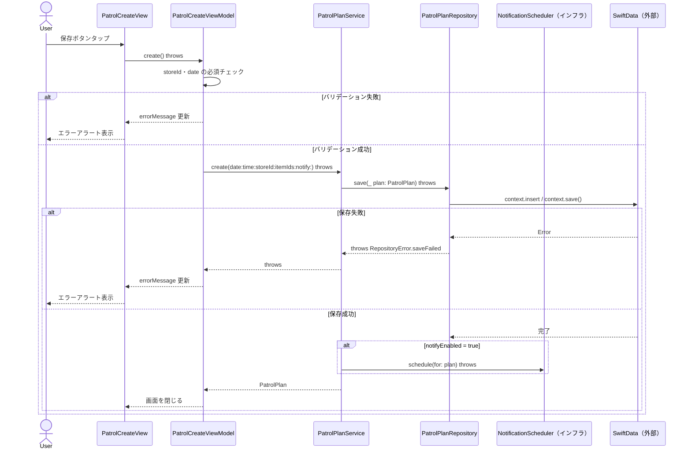
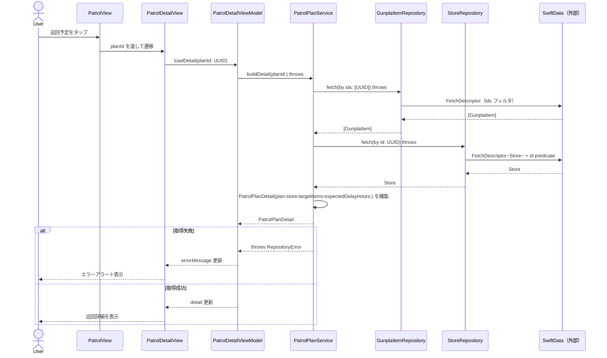

# F04 ガンプラ巡回 - 詳細シーケンス図

## 巡回予定の作成

```mermaid
sequenceDiagram
    actor User
    participant PatrolCreateView
    participant PatrolCreateViewModel
    participant PatrolPlanService
    participant PatrolPlanRepository
    participant NotificationScheduler（インフラ）
    participant SwiftData（外部）

    User->>PatrolCreateView: 保存ボタンタップ
    PatrolCreateView->>PatrolCreateViewModel: create() throws
    PatrolCreateViewModel->>PatrolCreateViewModel: storeId・date の必須チェック

    alt バリデーション失敗
        PatrolCreateViewModel-->>PatrolCreateView: errorMessage 更新
        PatrolCreateView-->>User: エラーアラート表示
    else バリデーション成功
        PatrolCreateViewModel->>PatrolPlanService: create(date:time:storeId:itemIds:notify:) throws
        PatrolPlanService->>PatrolPlanRepository: save(_ plan: PatrolPlan) throws
        PatrolPlanRepository->>SwiftData（外部）: context.insert / context.save()

        alt 保存失敗
            SwiftData（外部）-->>PatrolPlanRepository: Error
            PatrolPlanRepository-->>PatrolPlanService: throws RepositoryError.saveFailed
            PatrolPlanService-->>PatrolCreateViewModel: throws
            PatrolCreateViewModel-->>PatrolCreateView: errorMessage 更新
            PatrolCreateView-->>User: エラーアラート表示
        else 保存成功
            SwiftData（外部）-->>PatrolPlanRepository: 完了
            alt notifyEnabled = true
                PatrolPlanService->>NotificationScheduler（インフラ）: schedule(for: plan) throws
            end
            PatrolPlanService-->>PatrolCreateViewModel: PatrolPlan
            PatrolCreateViewModel-->>PatrolCreateView: 画面を閉じる
        end
    end
```

---

## 巡回詳細表示

```mermaid
sequenceDiagram
    actor User
    participant PatrolView
    participant PatrolDetailView
    participant PatrolDetailViewModel
    participant PatrolPlanService
    participant GunplaItemRepository
    participant StoreRepository
    participant SwiftData（外部）

    User->>PatrolView: 巡回予定をタップ
    PatrolView->>PatrolDetailView: planId を渡して遷移
    PatrolDetailView->>PatrolDetailViewModel: loadDetail(planId: UUID)
    PatrolDetailViewModel->>PatrolPlanService: buildDetail(planId:) throws
    PatrolPlanService->>GunplaItemRepository: fetch(by ids: [UUID]) throws
    GunplaItemRepository->>SwiftData（外部）: FetchDescriptor（ids フィルタ）
    SwiftData（外部）-->>GunplaItemRepository: [GunplaItem]
    GunplaItemRepository-->>PatrolPlanService: [GunplaItem]
    PatrolPlanService->>StoreRepository: fetch(by id: UUID) throws
    StoreRepository->>SwiftData（外部）: FetchDescriptor~Store~ + id predicate
    SwiftData（外部）-->>StoreRepository: Store
    StoreRepository-->>PatrolPlanService: Store
    PatrolPlanService->>PatrolPlanService: PatrolPlanDetail(plan:store:targetItems:expectedDelayHours:) を構築
    PatrolPlanService-->>PatrolDetailViewModel: PatrolPlanDetail

    alt 取得失敗
        PatrolPlanService-->>PatrolDetailViewModel: throws RepositoryError
        PatrolDetailViewModel-->>PatrolDetailView: errorMessage 更新
        PatrolDetailView-->>User: エラーアラート表示
    else 取得成功
        PatrolDetailViewModel-->>PatrolDetailView: detail 更新
        PatrolDetailView-->>User: 巡回詳細を表示
    end
```
