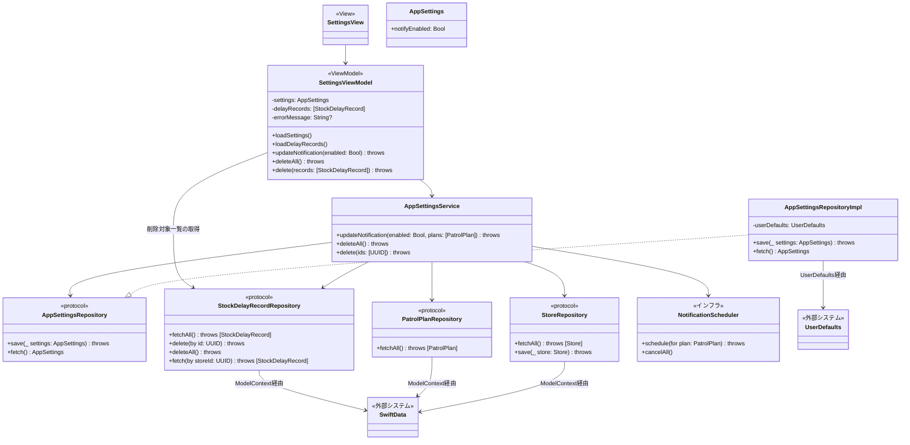

# F05 アプリ設定 - 詳細クラス図

```mermaid
classDiagram
    class SettingsView {
        <<View>>
    }

    class SettingsViewModel {
        <<ViewModel>>
        -settings: AppSettings
        -delayRecords: [StockDelayRecord]
        -errorMessage: String?
        +loadSettings()
        +loadDelayRecords()
        +updateNotification(enabled: Bool) throws
        +deleteAll() throws
        +delete(records: [StockDelayRecord]) throws
    }

    class AppSettingsService {
        +updateNotification(enabled: Bool, plans: [PatrolPlan]) throws
        +deleteAll() throws
        +delete(ids: [UUID]) throws
    }

    class AppSettingsRepository {
        <<protocol>>
        +save(_ settings: AppSettings) throws
        +fetch() AppSettings
    }

    class AppSettingsRepositoryImpl {
        -userDefaults: UserDefaults
        +save(_ settings: AppSettings) throws
        +fetch() AppSettings
    }

    class StockDelayRecordRepository {
        <<protocol>>
        +fetchAll() throws [StockDelayRecord]
        +delete(by id: UUID) throws
        +deleteAll() throws
        +fetch(by storeId: UUID) throws [StockDelayRecord]
    }

    class PatrolPlanRepository {
        <<protocol>>
        +fetchAll() throws [PatrolPlan]
    }

    class StoreRepository {
        <<protocol>>
        +fetchAll() throws [Store]
        +save(_ store: Store) throws
    }

    class NotificationScheduler {
        <<インフラ>>
        +schedule(for plan: PatrolPlan) throws
        +cancelAll()
    }

    class AppSettings {
        +notifyEnabled: Bool
    }

    class UserDefaults {
        <<外部システム>>
    }

    class SwiftData {
        <<外部システム>>
    }

    SettingsView --> SettingsViewModel
    SettingsViewModel --> AppSettingsService
    SettingsViewModel --> StockDelayRecordRepository : 削除対象一覧の取得
    AppSettingsService --> AppSettingsRepository
    AppSettingsService --> StockDelayRecordRepository
    AppSettingsService --> PatrolPlanRepository
    AppSettingsService --> StoreRepository
    AppSettingsService --> NotificationScheduler
    AppSettingsRepositoryImpl ..|> AppSettingsRepository : 実装
    AppSettingsRepositoryImpl --> UserDefaults : UserDefaults経由
    StockDelayRecordRepository --> SwiftData : ModelContext経由
    PatrolPlanRepository --> SwiftData : ModelContext経由
    StoreRepository --> SwiftData : ModelContext経由
```
