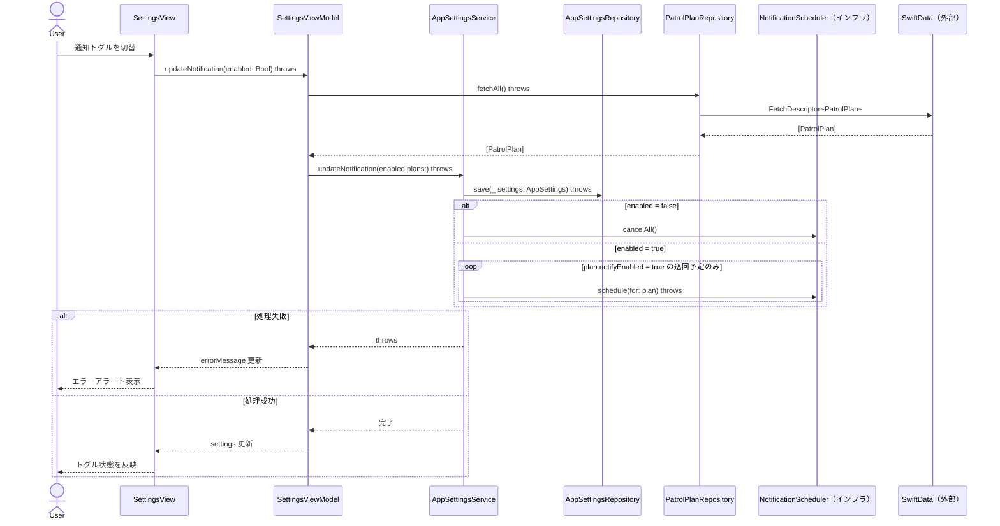
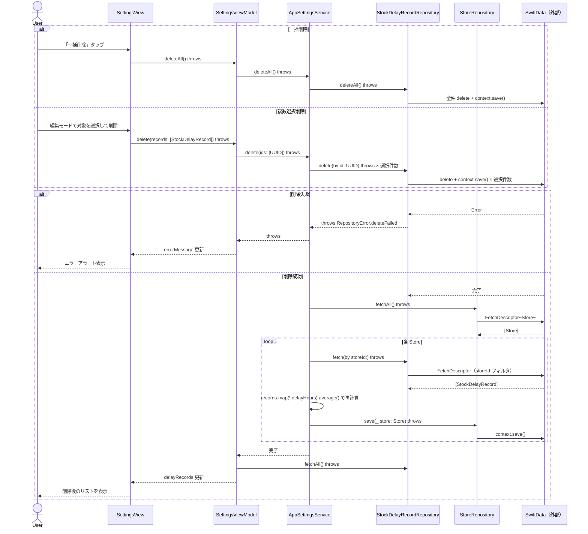

# F05 アプリ設定 - 詳細シーケンス図

## 通知設定の変更

```mermaid
sequenceDiagram
    actor User
    participant SettingsView
    participant SettingsViewModel
    participant AppSettingsService
    participant AppSettingsRepository
    participant PatrolPlanRepository
    participant NotificationScheduler（インフラ）
    participant SwiftData（外部）

    User->>SettingsView: 通知トグルを切替
    SettingsView->>SettingsViewModel: updateNotification(enabled: Bool) throws
    SettingsViewModel->>PatrolPlanRepository: fetchAll() throws
    PatrolPlanRepository->>SwiftData（外部）: FetchDescriptor~PatrolPlan~
    SwiftData（外部）-->>PatrolPlanRepository: [PatrolPlan]
    PatrolPlanRepository-->>SettingsViewModel: [PatrolPlan]
    SettingsViewModel->>AppSettingsService: updateNotification(enabled:plans:) throws
    AppSettingsService->>AppSettingsRepository: save(_ settings: AppSettings) throws

    alt enabled = false
        AppSettingsService->>NotificationScheduler（インフラ）: cancelAll()
    else enabled = true
        loop plan.notifyEnabled = true の巡回予定のみ
            AppSettingsService->>NotificationScheduler（インフラ）: schedule(for: plan) throws
        end
    end

    alt 処理失敗
        AppSettingsService-->>SettingsViewModel: throws
        SettingsViewModel-->>SettingsView: errorMessage 更新
        SettingsView-->>User: エラーアラート表示
    else 処理成功
        AppSettingsService-->>SettingsViewModel: 完了
        SettingsViewModel-->>SettingsView: settings 更新
        SettingsView-->>User: トグル状態を反映
    end
```

---

## 蓄積データの削除

```mermaid
sequenceDiagram
    actor User
    participant SettingsView
    participant SettingsViewModel
    participant AppSettingsService
    participant StockDelayRecordRepository
    participant StoreRepository
    participant SwiftData（外部）

    alt 一括削除
        User->>SettingsView: 「一括削除」タップ
        SettingsView->>SettingsViewModel: deleteAll() throws
        SettingsViewModel->>AppSettingsService: deleteAll() throws
        AppSettingsService->>StockDelayRecordRepository: deleteAll() throws
        StockDelayRecordRepository->>SwiftData（外部）: 全件 delete + context.save()
    else 複数選択削除
        User->>SettingsView: 編集モードで対象を選択して削除
        SettingsView->>SettingsViewModel: delete(records: [StockDelayRecord]) throws
        SettingsViewModel->>AppSettingsService: delete(ids: [UUID]) throws
        AppSettingsService->>StockDelayRecordRepository: delete(by id: UUID) throws × 選択件数
        StockDelayRecordRepository->>SwiftData（外部）: delete + context.save() × 選択件数
    end

    alt 削除失敗
        SwiftData（外部）-->>StockDelayRecordRepository: Error
        StockDelayRecordRepository-->>AppSettingsService: throws RepositoryError.deleteFailed
        AppSettingsService-->>SettingsViewModel: throws
        SettingsViewModel-->>SettingsView: errorMessage 更新
        SettingsView-->>User: エラーアラート表示
    else 削除成功
        SwiftData（外部）-->>StockDelayRecordRepository: 完了
        AppSettingsService->>StoreRepository: fetchAll() throws
        StoreRepository->>SwiftData（外部）: FetchDescriptor~Store~
        SwiftData（外部）-->>StoreRepository: [Store]
        loop 各 Store
            AppSettingsService->>StockDelayRecordRepository: fetch(by storeId:) throws
            StockDelayRecordRepository->>SwiftData（外部）: FetchDescriptor（storeId フィルタ）
            SwiftData（外部）-->>StockDelayRecordRepository: [StockDelayRecord]
            AppSettingsService->>AppSettingsService: records.map(\.delayHours).average() で再計算
            AppSettingsService->>StoreRepository: save(_ store: Store) throws
            StoreRepository->>SwiftData（外部）: context.save()
        end
        AppSettingsService-->>SettingsViewModel: 完了
        SettingsViewModel->>StockDelayRecordRepository: fetchAll() throws
        SettingsViewModel-->>SettingsView: delayRecords 更新
        SettingsView-->>User: 削除後のリストを表示
    end
```
