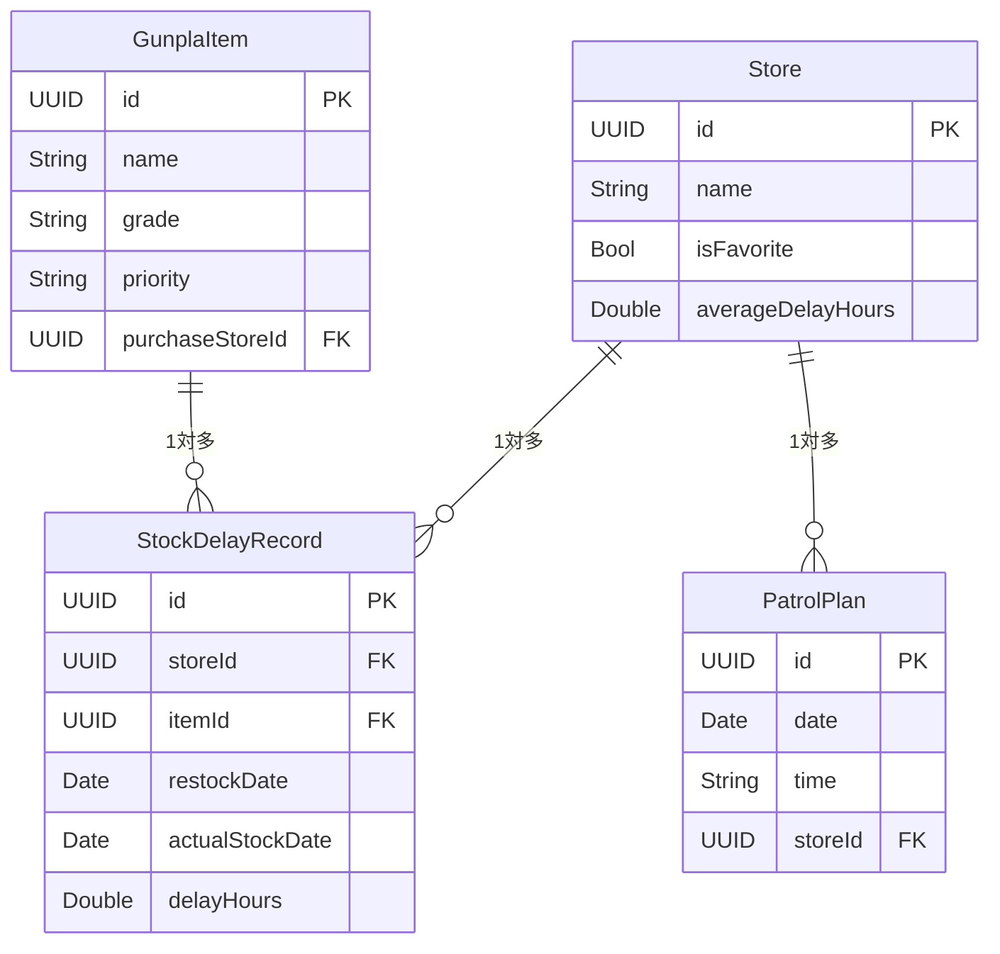

# データモデル設計書

永続化には **SwiftData** を使用する。各モデルは `@Model` マクロで定義する。

---

## GunplaItem

```swift
@Model
final class GunplaItem {
    var id: UUID = UUID()
    var name: String
    var grade: Grade
    var priority: Priority
    var price: Int?
    var imageData: Data?
    var url: URL?
    var releaseDate: Date?
    var restockDate: Date?
    var purchasedDate: Date?
    var purchaseStoreId: UUID?
    var tagColor: String            // HEXカラーコード（例: "#FF5733"）
}
```

| フィールド | 型 | 必須 | 備考 |
|-----------|-----|------|------|
| id | UUID | ○ | デフォルト値 UUID() |
| name | String | ○ | |
| grade | Grade | ○ | enum |
| priority | Priority | ○ | enum |
| price | Int? | - | 円単位 |
| imageData | Data? | - | 画像のバイナリ |
| url | URL? | - | Amazon・プレバン等 |
| releaseDate | Date? | - | |
| restockDate | Date? | - | 再販カレンダーと連携 |
| purchasedDate | Date? | - | |
| purchaseStoreId | UUID? | - | Store.id への参照 |
| tagColor | String | - | HEXコード、未設定時は空文字 |

---

## Store

```swift
@Model
final class Store {
    var id: UUID = UUID()
    var name: String
    var latitude: Double
    var longitude: Double
    var isFavorite: Bool = false
    var averageDelayHours: Double = 0.0
}
```

| フィールド | 型 | 必須 | 備考 |
|-----------|-----|------|------|
| id | UUID | ○ | |
| name | String | ○ | |
| latitude | Double | ○ | MapKit から取得 |
| longitude | Double | ○ | MapKit から取得 |
| isFavorite | Bool | ○ | デフォルト false |
| averageDelayHours | Double | ○ | StockDelayRecord 集計値。デフォルト 0.0 |

---

## StockDelayRecord

```swift
@Model
final class StockDelayRecord {
    var id: UUID = UUID()
    var storeId: UUID
    var itemId: UUID
    var restockDate: Date
    var actualStockDate: Date
    var delayHours: Double
}
```

| フィールド | 型 | 必須 | 備考 |
|-----------|-----|------|------|
| id | UUID | ○ | |
| storeId | UUID | ○ | Store.id への参照 |
| itemId | UUID | ○ | GunplaItem.id への参照 |
| restockDate | Date | ○ | 再販予定日（時刻は 00:00:00 で保持） |
| actualStockDate | Date | ○ | 実際の品出し日時 |
| delayHours | Double | ○ | actualStockDate - restockDate（時間単位） |

---

## PatrolPlan

```swift
@Model
final class PatrolPlan {
    var id: UUID = UUID()
    var date: Date
    var time: String                // "HH:mm" 形式
    var storeId: UUID
    var targetItemIds: [UUID] = []
    var notifyEnabled: Bool = true
}
```

| フィールド | 型 | 必須 | 備考 |
|-----------|-----|------|------|
| id | UUID | ○ | |
| date | Date | ○ | 時刻は 00:00:00 で保持 |
| time | String | ○ | "HH:mm" 形式（例: "10:30"） |
| storeId | UUID | ○ | Store.id への参照 |
| targetItemIds | [UUID] | - | GunplaItem.id のリスト |
| notifyEnabled | Bool | ○ | デフォルト true |

---

## AppSettings

SwiftData ではなく **UserDefaults** で永続化する（グローバル設定のため）。

```swift
struct AppSettings {
    var notifyEnabled: Bool = true
}
```

| フィールド | 型 | デフォルト | 備考 |
|-----------|-----|-----------|------|
| notifyEnabled | Bool | true | UserDefaults キー: `app.notify.enabled` |

---

## 関連図


